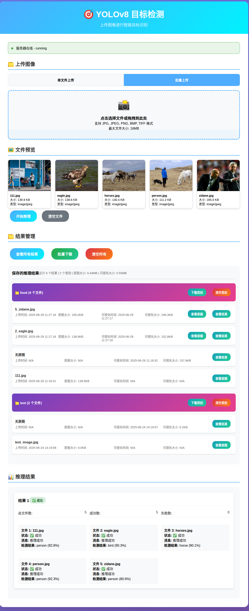

# 基于PyTorch的目标识别模型在Ubuntu系统中的部署与接口测试

> 课程设计实验报告 - YOLOv8 Flask API 部署与测试

## 📋 项目概述

本项目基于 **YOLOv8** 目标检测模型，在 **Ubuntu 虚拟机** 环境中实现了完整的模型部署、Flask Web API 接口开发、以及前后端集成的目标检测服务系统。项目包含命令行推理、Web 接口服务、批量处理、结果管理等完整功能模块。

#### 单文件上传功能

*图 1-1: 现代化的Web界面，支持拖拽上传和实时状态显示*

*图 1-2: 单文件上传测试结果，显示检测到的目标对象和置信度*

#### 批量上传功能

*图 1-3: 批量文件上传界面，支持多文件同时处理*

*图 1-4: 批量上传测试结果，展示多文件处理能力和结果管理功能*

### 🎯 项目特色
- ✅ **完整的环境配置流程** - 从零开始的 Ubuntu 环境搭建
- ✅ **标准化的 API 接口设计** - 符合 RESTful 规范
- ✅ **现代化的 Web 用户界面** - 支持拖拽上传、进度显示
- ✅ **完善的错误处理机制** - 各种异常情况的优雅处理
- ✅ **自动化测试工具** - 全面的接口测试和验证
- ✅ **结果管理功能** - 批量下载、分类管理、存储清理

### 📊 技术栈
- **深度学习框架**: PyTorch, Ultralytics YOLOv8
- **后端框架**: Flask, Flask-CORS
- **前端技术**: HTML5, CSS3, JavaScript (ES6+)
- **开发环境**: Ubuntu 20.04, Python 3.10, VMware
- **测试工具**: curl, 自定义 Python 测试脚本

---

## 📚 报告目录

### [第一章 项目目的与实现思路](chapter1.md)
- 1.1 项目背景与意义
- 1.2 技术选型与架构设计
- 1.3 功能需求分析
- 1.4 系统架构设计

### [第二章 环境配置与模型部署](chapter2.md)
- 2.1 Ubuntu 虚拟机环境搭建
- 2.2 Python 虚拟环境配置
- 2.3 依赖包安装与版本管理
- 2.4 YOLOv8 模型部署
- 2.5 命令行推理测试

### [第三章 核心功能实现](chapter3.md)
- 3.1 推理模块开发
- 3.2 Flask API实现
- 3.3 Web界面开发
- 3.4 结果管理功能

### [第四章 接口测试与验证](chapter4.md)
- 4.1 测试工具开发
- 4.2 API功能测试
- 4.3 性能测试
- 4.4 测试结果分析

### [第五章 网络配置与部署问题](chapter5.md)
- 5.1 网络环境配置
- 5.2 跨平台访问
- 5.3 问题排查过程
- 5.4 解决方案实施

### [第六章 项目总结与反思](chapter6.md)
- 6.1 任务完成情况
- 6.2 技术总结
- 6.3 经验与收获
- 6.4 改进方向

### [附录](appendix.md)
- A. 完整代码清单
- B. 配置文件示例
- C. 测试数据与结果
- D. 相关技术文档
- E. 参考资料

---

## 🏆 项目亮点

### 技术创新点
1. **统一的 API 返回格式** - 所有接口采用标准化的 JSON 响应格式
2. **线程安全的模型加载** - 使用锁机制确保并发访问安全
3. **智能文件校验** - 多层次的文件格式和内容验证
4. **结果管理系统** - 完整的文件管理、打包下载功能

### 用户体验优化
1. **现代化 UI 设计** - 渐变色彩、响应式布局、拖拽上传
2. **实时状态反馈** - 服务器状态监控、上传进度显示
3. **智能错误提示** - 详细的错误信息和解决建议
4. **一键批量操作** - 批量上传、批量下载、批量清理

### 工程化实践
1. **完整的测试覆盖** - 自动化测试、手动验证、性能测试
2. **规范的代码结构** - 模块化设计、清晰的注释、标准命名
3. **详细的文档说明** - API 文档、部署指南、使用手册
4. **容错机制设计** - 异常处理、资源清理、优雅降级

---

## 📈 学习成果

通过本次课程设计，深入学习和实践了：

- **深度学习模型部署** - 从模型训练到生产环境部署的完整流程
- **Web 服务开发** - Flask 框架、RESTful API 设计、前后端分离
- **系统集成与测试** - 自动化测试、接口验证、性能优化
- **Linux 系统管理** - Ubuntu 环境配置、网络设置、服务部署
- **项目管理** - 需求分析、架构设计、文档编写、版本控制

本报告详细记录了项目的完整实现过程，包含大量的截图、代码示例和实操步骤，可作为同类项目的参考手册。 
