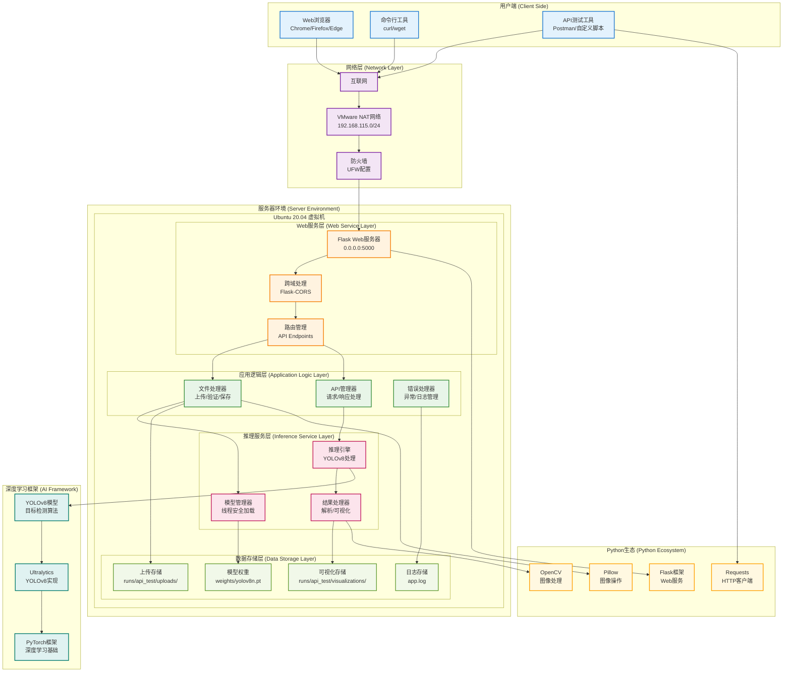
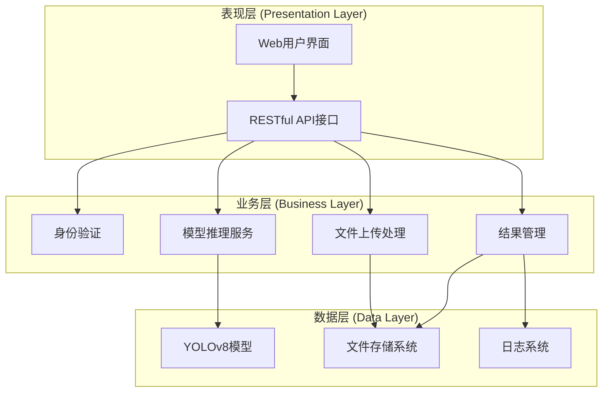
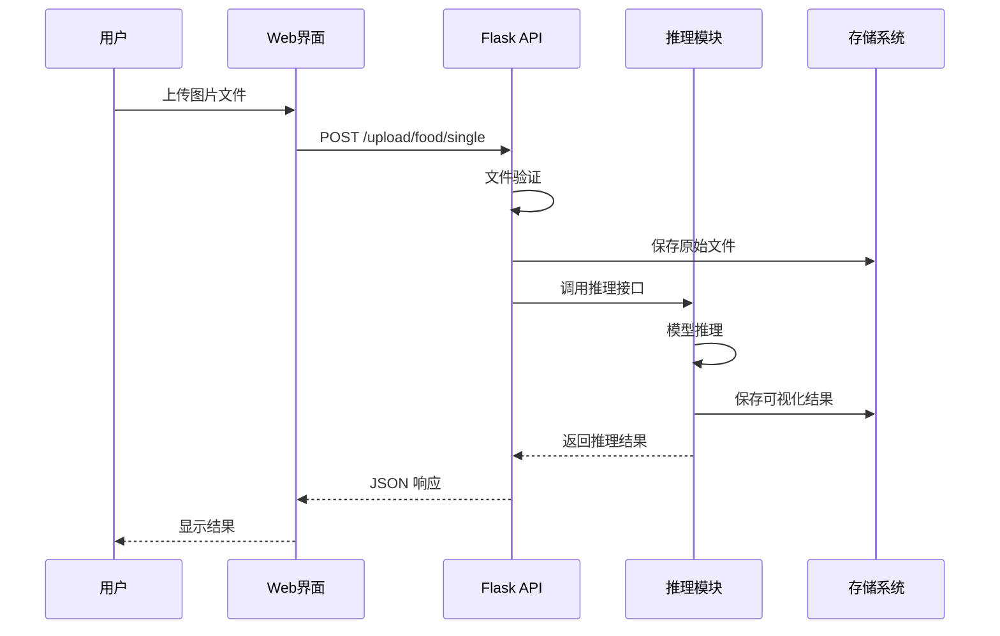
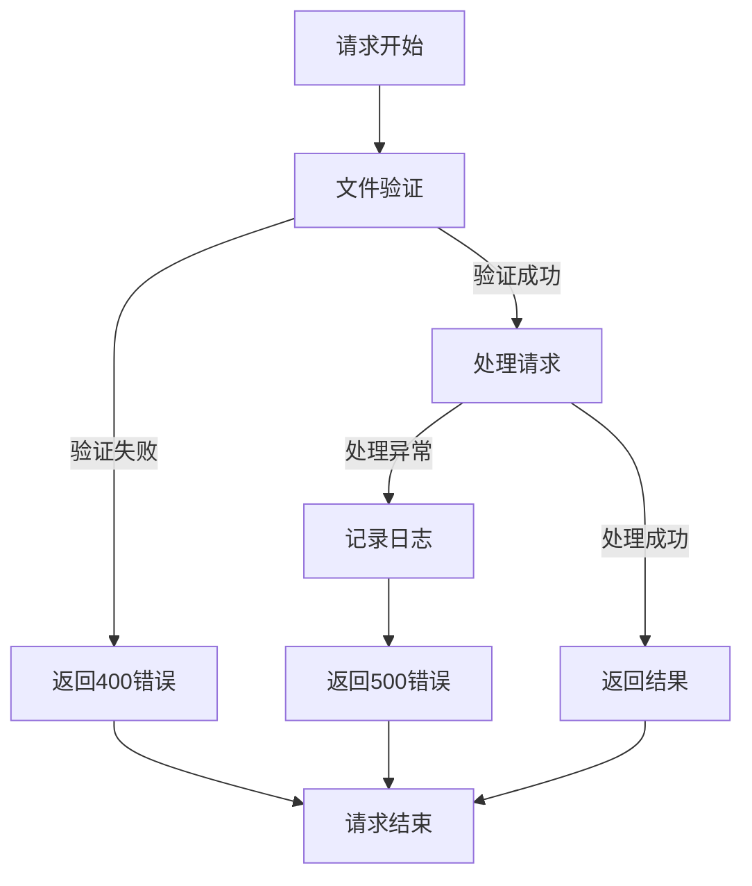

# 第一章 项目目的与实现思路

## 1.1 项目背景与意义

### 1.1.1 研究背景

随着人工智能技术的快速发展，目标检测技术在计算机视觉领域得到了广泛应用。从自动驾驶汽车的障碍物识别，到智能安防系统的人员监控，再到医疗影像的病灶检测，目标检测技术正在改变着我们的生活方式。

**YOLO (You Only Look Once)** 系列模型作为目标检测领域的经典算法，以其优秀的实时性能和检测精度受到了广泛关注。**YOLOv8** 作为该系列的最新版本，在保持高速推理的同时，进一步提升了检测精度，成为了工业界和学术界的热门选择。

### 1.1.2 项目意义

本课程设计项目具有以下重要意义：

#### 🎯 **教学价值**
- **理论与实践结合** - 将深度学习理论知识转化为可运行的实际应用
- **全栈技能培养** - 涵盖模型训练、后端开发、前端设计、系统部署等完整技术栈
- **工程化思维训练** - 学习标准化的软件开发流程和最佳实践

#### 🚀 **技术价值**
- **模型部署经验** - 掌握深度学习模型从研发到生产的完整部署流程
- **API 开发能力** - 学习 RESTful API 设计原则和 Flask 框架应用
- **系统集成技能** - 理解前后端分离架构和微服务设计思想

#### 💼 **实用价值**
- **可复用的框架** - 提供了一个通用的目标检测服务框架
- **完整的文档** - 详细的部署指南和使用手册，便于后续维护和扩展
- **最佳实践示例** - 规范的代码结构和开发流程，可作为其他项目的参考

### 1.1.3 技术挑战

在项目实施过程中，需要解决以下技术挑战：

1. **环境配置复杂性** - Ubuntu 系统、Python 环境、深度学习框架的协调配置
2. **模型性能优化** - 在保证精度的前提下，优化推理速度和内存使用
3. **并发访问处理** - 多用户同时访问时的资源管理和线程安全
4. **跨平台兼容性** - 虚拟机网络配置和宿主机访问问题
5. **用户体验设计** - 友好的界面设计和流畅的交互体验

---

## 1.2 技术选型与架构设计

### 1.2.1 技术选型原则

在进行技术选型时，我们遵循以下原则：

#### **成熟稳定性**
- 选择经过广泛验证的成熟技术栈
- 优先考虑活跃维护和长期支持的开源项目
- 确保技术组合的兼容性和稳定性

#### **学习成本**
- 考虑团队的技术背景和学习曲线
- 选择文档完善、社区活跃的技术
- 平衡技术先进性和实用性

#### **性能要求**
- 满足实时推理的性能需求
- 支持并发访问和扩展性
- 优化资源使用效率

### 1.2.2 核心技术栈

| 技术分层 | 选择方案 | 选型理由 |
|---------|---------|---------|
| **深度学习框架** | PyTorch + Ultralytics | 生态完善，易于使用，社区活跃 |
| **Web 框架** | Flask + Flask-CORS | 轻量级，灵活性高，学习成本低 |
| **前端技术** | HTML5 + CSS3 + JavaScript | 原生技术，无额外依赖，兼容性好 |
| **开发环境** | Ubuntu 20.04 + Python 3.10 | 稳定的 LTS 版本，广泛支持 |
| **虚拟化平台** | VMware Workstation | 成熟的虚拟化解决方案 |

#### **PyTorch + Ultralytics YOLOv8**
```python
# 模型加载示例
from ultralytics import YOLO
model = YOLO('yolov8n.pt')  # 轻量级版本，适合教学演示
```

**选择理由**：
- PyTorch 生态系统完善，文档详细
- Ultralytics 提供了开箱即用的 YOLOv8 实现
- 支持多种模型规格（n/s/m/l/x），便于性能调优
- 良好的 Python 集成，易于二次开发

#### **Flask Web 框架**
```python
# Flask 应用示例
from flask import Flask, request, jsonify
from flask_cors import CORS

app = Flask(__name__)
CORS(app)  # 支持跨域访问
```

**选择理由**：
- 轻量级框架，启动快速，资源占用少
- 灵活性高，易于自定义和扩展
- 丰富的扩展插件生态
- 适合中小型项目和快速原型开发

### 1.2.3 系统架构设计

#### **整体架构图**

#### **系统整体架构图**



#### **三层架构设计**



#### **核心模块划分**

1. **模型推理模块 (predict.py)**
   - 负责 YOLOv8 模型的加载和推理
   - 提供线程安全的模型访问
   - 支持批量推理和结果可视化

2. **Web 服务模块 (app.py)**
   - Flask 应用主程序
   - RESTful API 接口定义
   - 请求路由和错误处理

3. **前端界面模块 (static/upload.html)**
   - 用户交互界面
   - 文件上传和结果展示
   - 实时状态监控

4. **测试验证模块**
   - 自动化接口测试
   - 性能基准测试
   - 兼容性验证

---

## 1.3 功能需求分析

### 1.3.1 功能需求概述

基于课程设计任务要求，系统需要实现以下核心功能：

#### **基础功能需求**
- ✅ 命令行推理功能
- ✅ Web 接口服务
- ✅ 单文件/批量文件上传
- ✅ 推理结果可视化
- ✅ 接口测试验证

#### **扩展功能需求**
- ✅ 结果管理系统
- ✅ 批量下载功能
- ✅ 实时状态监控
- ✅ 错误处理机制
- ✅ 日志记录系统

### 1.3.2 用户角色分析

#### **开发者用户**
- **需求**：部署和配置系统，进行二次开发
- **关注点**：代码质量、文档完整性、扩展性
- **使用场景**：本地开发、代码调试、功能扩展

#### **测试用户**
- **需求**：验证系统功能，进行性能测试
- **关注点**：功能完整性、稳定性、性能指标
- **使用场景**：接口测试、压力测试、兼容性验证

#### **最终用户**
- **需求**：通过 Web 界面使用目标检测服务
- **关注点**：易用性、响应速度、结果准确性
- **使用场景**：图片上传、结果查看、批量处理

### 1.3.3 详细功能规格

#### **F1. 命令行推理功能**

**功能描述**：通过命令行调用模型进行单张图片的目标检测

**输入规格**：
- 图片文件路径（支持 jpg、png、bmp 等格式）
- 模型权重文件路径（可选，默认使用 yolov8n.pt）
- 输出目录路径（可选，默认 runs/local_test）

**输出规格**：
- 控制台输出：检测结果摘要信息
- 文件输出：带标注框的可视化图片
- JSON 格式：详细的检测结果数据

**使用示例**：
```bash
python predict.py -s test_image.jpg -w weights/yolov8n.pt -o runs/test
```

#### **F2. Web 接口服务**

**F2.1 健康检查接口**
- **路径**：`GET /test`
- **功能**：检查服务器状态和模型加载情况
- **返回**：服务器信息、模型状态、配置参数

**F2.2 单文件上传接口**
- **路径**：`POST /upload/<category>/single`
- **功能**：上传单个图片文件进行推理
- **参数**：multipart/form-data 格式的图片文件
- **返回**：推理结果、可视化图片路径、性能指标

**F2.3 批量文件上传接口**
- **路径**：`POST /upload/<category>/multiple`
- **功能**：同时上传多个图片文件进行批量推理
- **参数**：多个 multipart/form-data 格式的图片文件
- **返回**：每个文件的处理状态和结果

#### **F3. 结果管理功能**

**F3.1 结果列表查询**
- **路径**：`GET /results`
- **功能**：获取所有保存的推理结果列表
- **返回**：文件列表、统计信息、分类汇总

**F3.2 批量下载功能**
- **路径**：`GET /results/download`
- **功能**：打包下载所有推理结果
- **返回**：ZIP 压缩文件，包含原图和可视化结果

**F3.3 数据清理功能**
- **路径**：`DELETE /results/clean`
- **功能**：清理存储的推理结果文件
- **返回**：清理统计信息

---

## 1.4 系统架构设计

### 1.4.1 模块化设计原则

#### **单一职责原则 (SRP)**
每个模块专注于一个特定的功能领域：
- `predict.py` - 专注于模型推理逻辑
- `app.py` - 专注于 Web 服务和 API 路由
- `static/upload.html` - 专注于用户界面交互

#### **开放封闭原则 (OCP)**
系统设计支持扩展而不修改核心代码：
- 插件式的模型加载机制
- 可配置的存储路径和参数
- 标准化的 API 接口设计

#### **依赖倒置原则 (DIP)**
高层模块不依赖低层模块的具体实现：
- 抽象的推理接口定义
- 可替换的存储后端
- 标准化的配置管理

### 1.4.2 数据流设计

#### **用户请求处理流程**



#### **错误处理流程**



### 1.4.3 性能优化设计

#### **模型加载优化**
- **单例模式**：全局共享模型实例，避免重复加载
- **线程安全**：使用锁机制保证并发访问安全
- **延迟加载**：首次调用时才加载模型，减少启动时间

```python
# 线程安全的模型加载实现
import threading

_model = None
_model_lock = threading.Lock()

def load_model(weights):
    global _model
    with _model_lock:
        if _model is None:
            _model = YOLO(str(weights))
    return _model
```

#### **文件处理优化**
- **流式处理**：大文件分块读取，避免内存溢出
- **异步处理**：长时间操作使用异步执行
- **资源清理**：及时释放临时文件和内存资源

#### **网络通信优化**
- **GZIP 压缩**：减少网络传输数据量
- **缓存策略**：静态资源缓存，减少重复请求
- **连接复用**：HTTP 连接池，提高并发性能

### 1.4.4 安全性设计

#### **输入验证**
- **文件类型检查**：限制允许的文件格式
- **文件大小限制**：防止大文件攻击
- **内容验证**：检查文件内容的有效性

#### **访问控制**
- **CORS 配置**：控制跨域访问权限
- **请求频率限制**：防止 DoS 攻击
- **文件路径验证**：防止路径遍历攻击

#### **数据保护**
- **敏感信息过滤**：避免在日志中记录敏感数据
- **临时文件清理**：定期清理临时文件
- **错误信息控制**：避免泄露系统内部信息

---

本章从项目背景、技术选型、需求分析、架构设计四个方面全面阐述了项目的总体设计思路。下一章将详细介绍环境配置与模型部署的具体实现过程。 