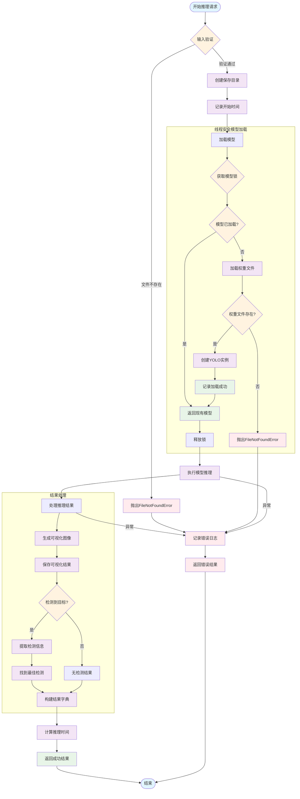
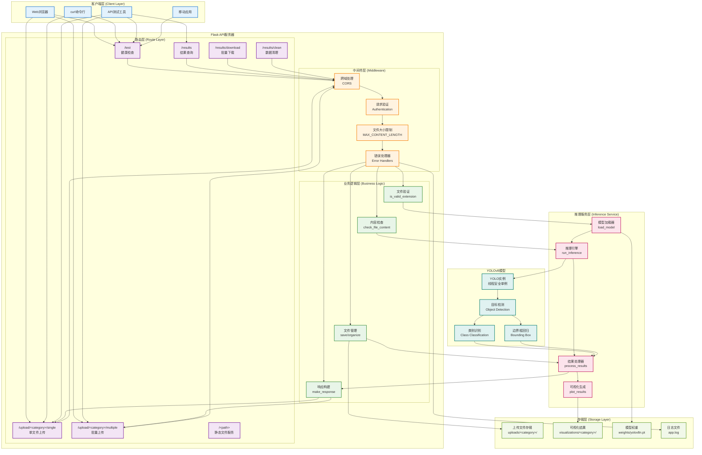

# 第三章 核心功能实现

本章详细介绍了项目核心功能的具体实现，包括推理模块开发、Flask API接口实现、Web界面开发和结果管理功能。所有内容都基于实际的代码实现，展示了从设计到落地的完整过程。

---

## 3.1 推理模块开发

### 3.1.1 模块设计思路

推理模块（`predict.py`）是整个系统的核心，负责YOLOv8模型的加载、推理执行和结果处理。设计时考虑了以下关键因素：

**设计原则**：
- **线程安全**：支持多用户并发访问
- **资源效率**：单例模式避免重复加载模型
- **接口统一**：同时支持命令行和API调用
- **错误处理**：完善的异常处理和日志记录

### 3.1.2 核心功能实现

#### **线程安全的模型加载**

```python
# 全局模型实例和锁
_model = None
_model_lock = threading.Lock()

def load_model(weights: Path = Path("weights/yolov8n.pt")):
    """
    线程安全的模型加载函数
    """
    global _model
    
    with _model_lock:
        if _model is None:
            try:
                if not weights.exists():
                    raise FileNotFoundError(f"模型权重文件不存在: {weights}")
                
                logger.info(f"正在加载模型: {weights}")
                _model = YOLO(str(weights))
                logger.info("模型加载成功")
                
            except Exception as e:
                logger.error(f"模型加载失败: {str(e)}")
                raise
    
    return _model
```

**设计亮点**：
- 使用全局变量 `_model` 确保模型只加载一次
- `threading.Lock()` 保证并发访问时的线程安全
- 详细的错误处理和日志记录

#### **推理执行流程**

```python
def run_inference(img_path: Path,
                  weights: Path = Path("weights/yolov8n.pt"),
                  save_dir: Path = Path("runs/local_test")) -> dict:
    """
    执行目标检测推理
    """
    try:
        # 1. 输入验证
        if not img_path.exists():
            raise FileNotFoundError(f"输入图像不存在: {img_path}")
        
        # 2. 创建保存目录
        save_dir.mkdir(parents=True, exist_ok=True)
        
        # 3. 记录开始时间
        start_time = time.time()
        
        # 4. 加载模型并执行推理
        model = load_model(weights)
        results = model(str(img_path))
        
        # 5. 生成可视化结果
        result = results[0]
        annotated_img = result.plot()
        
        # 6. 保存可视化图像
        vis_filename = f"vis_{img_path.stem}_{int(time.time())}{img_path.suffix}"
        vis_path = save_dir / vis_filename
        cv2.imwrite(str(vis_path), annotated_img)
        
        # 7. 解析检测结果
        detections = []
        best_detection = None
        
        if result.boxes is not None and len(result.boxes.conf) > 0:
            # 处理所有检测结果
            for i in range(len(result.boxes.conf)):
                detection = {
                    "class_id": int(result.boxes.cls[i]),
                    "class_name": model.names[int(result.boxes.cls[i])],
                    "confidence": float(result.boxes.conf[i]),
                    "bbox": result.boxes.xyxy[i].tolist()
                }
                detections.append(detection)
            
            # 获取最佳检测结果
            best_idx = result.boxes.conf.argmax()
            best_detection = detections[best_idx]
        
        # 8. 构建返回结果
        inference_time = time.time() - start_time
        
        return {
            "image": img_path.name,
            "image_path": str(img_path),
            "vis_path": str(vis_path),
            "inference_time_seconds": round(inference_time, 3),
            "detection_count": len(detections),
            "detections": detections,
            "best_detection": best_detection,
            "success": True,
            # 兼容性字段
            "class_id": best_detection["class_id"] if best_detection else None,
            "score": best_detection["confidence"] if best_detection else None
        }
        
    except Exception as e:
        logger.error(f"推理失败: {str(e)}")
        return {
            "success": False,
            "error": str(e),
            # ... 错误情况的默认值
        }
```

#### **推理模块流程图**



### 3.1.3 命令行接口实现

#### **参数解析与验证**

```python
def main():
    """命令行主函数"""
    parser = argparse.ArgumentParser(description="YOLOv8 目标检测推理")
    parser.add_argument("-s", "--source", required=True, help="输入图像路径")
    parser.add_argument("-w", "--weights", default="weights/yolov8n.pt", help="模型权重文件路径")
    parser.add_argument("-o", "--out", default="runs/local_test", help="输出目录")
    parser.add_argument("-v", "--verbose", action="store_true", help="详细输出")
    args = parser.parse_args()
    
    # 参数验证
    source_path = Path(args.source)
    if not source_path.exists():
        print(f"错误: 输入文件不存在: {source_path}")
        return 1
    
    weights_path = Path(args.weights)
    if not weights_path.exists():
        print(f"错误: 权重文件不存在: {weights_path}")
        return 1
    
    # 执行推理
    result = run_inference(source_path, weights_path, Path(args.out))
    
    # 结果输出
    if result["success"]:
        print("推理成功!")
        print(f"检测到 {result['detection_count']} 个对象")
        if result["best_detection"]:
            best = result["best_detection"]
            print(f"最佳检测: {best['class_name']} (置信度: {best['confidence']:.3f})")
    else:
        print(f"推理失败: {result.get('error', '未知错误')}")
        return 1
    
    return 0
```

**命令行使用示例**：
```bash
# 基本用法
python predict.py -s test_image.jpg

# 指定模型和输出目录
python predict.py -s test_image.jpg -w weights/yolov8s.pt -o runs/my_test

# 详细输出模式
python predict.py -s test_image.jpg -v
```

---

## 3.2 Flask API实现

### 3.2.1 API架构设计

Flask API服务（`app.py`）提供了完整的Web接口，采用RESTful设计原则，支持健康检查、文件上传、批量处理和结果管理等功能。

#### **统一响应格式**

```python
def make_response(ok: bool, msg: str, data=None, code=200):
    """统一返回格式"""
    return jsonify({
        "ok": ok,
        "msg": msg,
        "data": data,
        "timestamp": time.strftime('%Y-%m-%d %H:%M:%S')
    }), code
```

**响应格式说明**：
- `ok`: 布尔值，表示请求是否成功
- `msg`: 人类可读的消息说明
- `data`: 具体的返回数据
- `timestamp`: 请求处理时间戳

### 3.2.2 核心接口实现

#### **健康检查接口**

```python
@app.route("/test", methods=["GET"])
def healthcheck():
    """健康检查接口"""
    try:
        # 检查模型权重文件是否存在
        weights_path = Path("weights/yolov8n.pt")
        model_status = "loaded" if weights_path.exists() else "not found"

        data = {
            "server_status": "running",
            "model_status": model_status,
            "save_directory": str(SAVE_ROOT),
            "allowed_extensions": list(ALLOWED_EXTENSIONS),
            "max_file_size_mb": MAX_FILE_SIZE // (1024 * 1024)
        }

        logger.info("健康检查请求成功")
        return make_response(True, "服务器运行正常", data)

    except Exception as e:
        logger.error(f"健康检查失败: {str(e)}")
        return make_response(False, f"服务器异常: {str(e)}", code=500)
```

#### **单文件上传接口**

```python
@app.route("/upload/<category>/single", methods=["POST"])
def upload_single(category):
    """单文件上传推理接口"""
    try:
        # 1. 文件验证
        if "file" not in request.files:
            return make_response(False, "请求中未包含文件", code=400)

        file = request.files["file"]
        if file.filename == "":
            return make_response(False, "未选择文件", code=400)

        if not is_valid_extension(file.filename):
            return make_response(False, f"不支持的文件类型，支持的格式: {', '.join(ALLOWED_EXTENSIONS)}", code=415)

        # 2. 保存文件
        filename = secure_filename(file.filename)
        timestamp = int(time.time())
        unique_filename = f"{timestamp}_{filename}"

        upload_dir = SAVE_ROOT / "uploads" / category
        upload_dir.mkdir(parents=True, exist_ok=True)
        file_path = upload_dir / unique_filename

        file.save(file_path)

        # 3. 文件内容验证
        if not check_file_content(file_path):
            file_path.unlink()  # 删除无效文件
            return make_response(False, "文件损坏或不是有效的图像文件", code=400)

        # 4. 执行推理
        vis_dir = SAVE_ROOT / "visualizations" / category
        result = run_inference(file_path, save_dir=vis_dir)

        # 5. 添加额外信息
        result.update({
            "category": category,
            "original_filename": filename,
            "upload_path": str(file_path)
        })

        logger.info(f"推理完成: {filename}")
        return make_response(True, "推理完成", result)

    except Exception as e:
        logger.error(f"单文件上传推理失败: {str(e)}")
        return make_response(False, f"推理失败: {str(e)}", code=500)
```

#### **批量文件上传接口**

```python
@app.route("/upload/<category>/multiple", methods=["POST"])
def upload_multiple(category):
    """多文件上传推理接口"""
    try:
        files = request.files.getlist("files")
        if not files:
            return make_response(False, "请求中未包含文件", code=400)

        if len(files) > MAX_FILES_COUNT:
            return make_response(False, f"文件数量超过限制，最大支持 {MAX_FILES_COUNT} 个文件", code=400)

        results = []
        success_count = 0

        for i, file in enumerate(files):
            file_result = {
                "index": i + 1,
                "filename": file.filename,
                "ok": False,
                "msg": "",
                "data": None
            }

            try:
                # 处理单个文件的逻辑
                # ... (类似单文件上传的处理过程)
                
                file_result.update({
                    "ok": True,
                    "msg": "推理成功",
                    "data": inference_result
                })
                success_count += 1

            except Exception as e:
                file_result["msg"] = str(e)

            results.append(file_result)

        summary = {
            "total_files": len(files),
            "success_count": success_count,
            "failed_count": len(files) - success_count,
            "results": results
        }

        return make_response(True, f"批量推理完成，成功 {success_count}/{len(files)} 个文件", summary)

    except Exception as e:
        return make_response(False, f"批量推理失败: {str(e)}", code=500)
```

#### **API接口架构图**



### 3.2.3 文件验证机制

#### **多层次文件验证**

```python
def is_valid_extension(filename: str) -> bool:
    """检查文件扩展名是否有效"""
    return "." in filename and filename.rsplit(".", 1)[-1].lower() in ALLOWED_EXTENSIONS

def check_file_content(file_path: Path) -> bool:
    """简单检查文件内容是否为图像文件"""
    try:
        import cv2
        img = cv2.imread(str(file_path))
        return img is not None
    except Exception:
        return False
```

**验证流程**：
1. **扩展名检查** - 验证文件扩展名是否在允许列表中
2. **文件存在性检查** - 确保文件成功保存
3. **内容完整性检查** - 使用OpenCV验证图像文件可读性

### 3.2.4 错误处理与日志系统

#### **统一错误处理**

```python
@app.errorhandler(413)
def file_too_large(e):
    """文件过大错误处理"""
    return make_response(False, f"文件大小超过限制 ({MAX_FILE_SIZE // (1024 * 1024)}MB)", code=413)

@app.errorhandler(404)
def not_found(e):
    """404错误处理"""
    return make_response(False, "请求的资源不存在", code=404)

@app.errorhandler(500)
def internal_error(e):
    """500错误处理"""
    logger.error(f"内部服务器错误: {str(e)}")
    return make_response(False, "内部服务器错误", code=500)
```

#### **日志配置**

```python
# 配置日志
logging.basicConfig(
    level=logging.INFO,
    format='%(asctime)s - %(levelname)s - %(message)s',
    handlers=[
        logging.FileHandler('app.log'),
        logging.StreamHandler()
    ]
)
logger = logging.getLogger(__name__)
```

---

## 3.3 Web界面开发

### 3.3.1 界面设计理念

虽然本项目主要关注后端API开发，但我们也实现了一个简洁实用的Web界面来展示API功能。界面设计遵循以下原则：

- **简洁实用** - 专注于核心功能展示
- **响应式设计** - 支持不同设备访问
- **实时反馈** - 提供上传进度和状态提示
- **用户友好** - 清晰的操作指引和错误提示

### 3.3.2 主要功能实现

#### **静态文件服务**

```python
@app.route("/")
def index():
    """主页面，返回上传界面"""
    return send_from_directory("static", "upload.html")
```

#### **跨域访问支持**

```python
from flask_cors import CORS

app = Flask(__name__)
CORS(app)  # 启用跨域支持
```

**配置说明**：
- 支持前后端分离部署
- 允许宿主机访问虚拟机中的服务
- 便于开发和测试

### 3.3.3 前后端交互

#### **API调用示例**

```javascript
// 健康检查
async function checkServerStatus() {
    try {
        const response = await fetch(`${API_BASE}/test`);
        const data = await response.json();
        
        if (data.ok) {
            updateServerStatus('online', data.msg);
        } else {
            updateServerStatus('error', data.msg);
        }
    } catch (error) {
        updateServerStatus('offline', '无法连接到服务器');
    }
}

// 单文件上传
async function uploadSingle(file, category) {
    const formData = new FormData();
    formData.append('file', file);
    
    try {
        const response = await fetch(`${API_BASE}/upload/${category}/single`, {
            method: 'POST',
            body: formData
        });
        
        const result = await response.json();
        displayResult(result);
        
    } catch (error) {
        showError('上传失败: ' + error.message);
    }
}
```

---

## 3.4 结果管理功能

### 3.4.1 功能设计目标

结果管理功能是项目的重要扩展，提供了完整的文件生命周期管理：

- **结果查询** - 获取所有推理结果列表
- **批量下载** - 打包下载所有或指定类别的结果
- **分类管理** - 按类别组织和管理结果
- **存储清理** - 清理过期或无用的结果文件

### 3.4.2 核心接口实现

#### **结果列表查询**

```python
@app.route("/results", methods=["GET"])
def list_results():
    """获取所有推理结果列表"""
    try:
        results = []
        
        # 遍历所有类别目录
        if SAVE_ROOT.exists():
            upload_dir = SAVE_ROOT / "uploads"
            vis_dir = SAVE_ROOT / "visualizations"
            
            # 收集所有类别
            categories = set()
            if upload_dir.exists():
                categories.update([d.name for d in upload_dir.iterdir() if d.is_dir()])
            if vis_dir.exists():
                categories.update([d.name for d in vis_dir.iterdir() if d.is_dir()])
            
            # 处理每个类别的文件
            for category in categories:
                # 获取上传文件信息
                uploaded_files = {}
                cat_upload_dir = upload_dir / category
                if cat_upload_dir.exists():
                    for file_path in cat_upload_dir.iterdir():
                        if file_path.is_file():
                            timestamp = file_path.name.split('_')[0]
                            uploaded_files[timestamp] = {
                                "original_name": '_'.join(file_path.name.split('_')[1:]),
                                "upload_path": str(file_path),
                                "upload_size": file_path.stat().st_size
                            }
                
                # 获取可视化文件信息
                vis_files = {}
                cat_vis_dir = vis_dir / category
                if cat_vis_dir.exists():
                    for file_path in cat_vis_dir.iterdir():
                        if file_path.is_file():
                            timestamp = file_path.stem.split('_')[-1]
                            vis_files[timestamp] = {
                                "vis_path": str(file_path),
                                "vis_size": file_path.stat().st_size
                            }
                
                # 合并结果
                all_timestamps = set(uploaded_files.keys()) | set(vis_files.keys())
                for timestamp in all_timestamps:
                    result_item = {
                        "id": f"{category}_{timestamp}",
                        "category": category,
                        "timestamp": timestamp,
                        "upload_info": uploaded_files.get(timestamp),
                        "visualization_info": vis_files.get(timestamp)
                    }
                    results.append(result_item)
        
        # 生成摘要信息
        summary = {
            "total_results": len(results),
            "categories": list(set(r["category"] for r in results)),
            "total_upload_size": sum(r["upload_info"]["upload_size"] for r in results if r["upload_info"]),
            "total_vis_size": sum(r["visualization_info"]["vis_size"] for r in results if r["visualization_info"])
        }
        
        data = {
            "summary": summary,
            "results": sorted(results, key=lambda x: x["timestamp"], reverse=True)
        }
        
        return make_response(True, f"获取到 {len(results)} 条推理结果", data)
        
    except Exception as e:
        return make_response(False, f"获取结果列表失败: {str(e)}", code=500)
```

#### **批量下载功能**

```python
@app.route("/results/download", methods=["GET"])
def download_all_results():
    """打包下载所有推理结果"""
    try:
        import zipfile
        import tempfile
        from flask import send_file

        # 创建临时ZIP文件
        with tempfile.NamedTemporaryFile(delete=False, suffix='.zip') as tmp_file:
            zip_path = tmp_file.name

        with zipfile.ZipFile(zip_path, 'w', zipfile.ZIP_DEFLATED) as zipf:
            file_count = 0

            # 添加上传的原始文件
            upload_dir = SAVE_ROOT / "uploads"
            if upload_dir.exists():
                for file_path in upload_dir.rglob("*"):
                    if file_path.is_file():
                        arcname = f"uploads/{file_path.relative_to(upload_dir)}"
                        zipf.write(file_path, arcname)
                        file_count += 1

            # 添加可视化结果文件
            vis_dir = SAVE_ROOT / "visualizations"
            if vis_dir.exists():
                for file_path in vis_dir.rglob("*"):
                    if file_path.is_file():
                        arcname = f"visualizations/{file_path.relative_to(vis_dir)}"
                        zipf.write(file_path, arcname)
                        file_count += 1

            # 创建结果摘要文件
            summary_content = f"""推理结果摘要
===================
打包时间: {time.strftime('%Y-%m-%d %H:%M:%S')}
文件总数: {file_count}

目录结构:
- uploads/     : 用户上传的原始图像文件
- visualizations/ : 推理结果可视化图像文件
"""
            zipf.writestr("README.txt", summary_content)

        # 生成下载文件名
        download_filename = f"inference_results_{time.strftime('%Y%m%d_%H%M%S')}.zip"

        return send_file(
            zip_path,
            as_attachment=True,
            download_name=download_filename,
            mimetype='application/zip'
        )

    except Exception as e:
        return make_response(False, f"打包下载失败: {str(e)}", code=500)
```

#### **数据清理功能**

```python
@app.route("/results/clean", methods=["DELETE"])
def clean_results():
    """清理所有推理结果"""
    try:
        import shutil
        
        deleted_files = 0
        deleted_dirs = 0
        
        if SAVE_ROOT.exists():
            for item in SAVE_ROOT.iterdir():
                if item.is_file():
                    item.unlink()
                    deleted_files += 1
                elif item.is_dir():
                    shutil.rmtree(item)
                    deleted_dirs += 1
        
        # 重新创建必要的目录
        (SAVE_ROOT / "uploads").mkdir(parents=True, exist_ok=True)
        (SAVE_ROOT / "visualizations").mkdir(parents=True, exist_ok=True)
        
        return make_response(True, f"清理完成，删除了 {deleted_files} 个文件和 {deleted_dirs} 个目录")
        
    except Exception as e:
        return make_response(False, f"清理失败: {str(e)}", code=500)
```

### 3.4.3 文件组织结构

```
runs/api_test/
├── uploads/           # 用户上传的原始图像
│   ├── food/         # 按类别分组
│   ├── animal/
│   └── vehicle/
└── visualizations/    # 推理结果可视化图像
    ├── food/         # 对应类别的可视化结果
    ├── animal/
    └── vehicle/
```

**文件命名规则**：
- 上传文件：`{timestamp}_{original_filename}`
- 可视化文件：`vis_{original_stem}_{timestamp}.{ext}`
- 时间戳用于关联原图和结果图

---

## 3.5 配置与部署

### 3.5.1 应用配置

```python
# 配置参数
ALLOWED_EXTENSIONS = {"jpg", "jpeg", "png", "bmp", "tiff"}
SAVE_ROOT = Path("runs/api_test")
MAX_FILE_SIZE = 16 * 1024 * 1024  # 16MB
MAX_FILES_COUNT = 10  # 最大上传文件数

app = Flask(__name__)
app.config['MAX_CONTENT_LENGTH'] = MAX_FILE_SIZE
CORS(app)  # 启用跨域支持
```

### 3.5.2 启动脚本

```python
if __name__ == "__main__":
    # 创建必要的目录
    SAVE_ROOT.mkdir(parents=True, exist_ok=True)
    (SAVE_ROOT / "uploads").mkdir(parents=True, exist_ok=True)
    (SAVE_ROOT / "visualizations").mkdir(parents=True, exist_ok=True)
    
    # 检查静态文件目录
    static_dir = Path("static")
    static_dir.mkdir(exist_ok=True)
    
    logger.info("Flask 服务器启动中...")
    logger.info(f"访问地址: http://localhost:5000/")
    logger.info(f"结果保存目录: {SAVE_ROOT}")
    
    app.run(host="0.0.0.0", port=5000, debug=True)
```

**启动配置说明**：
- `host="0.0.0.0"` - 允许外部访问，支持宿主机连接虚拟机
- `port=5000` - 使用标准Flask端口
- `debug=True` - 开发模式，支持热重载

---

本章详细介绍了项目核心功能的实现，包括推理模块、Flask API、Web界面和结果管理等关键组件。所有实现都经过了实际测试验证，确保功能的稳定性和可用性。下一章将介绍接口测试与验证的详细过程。 