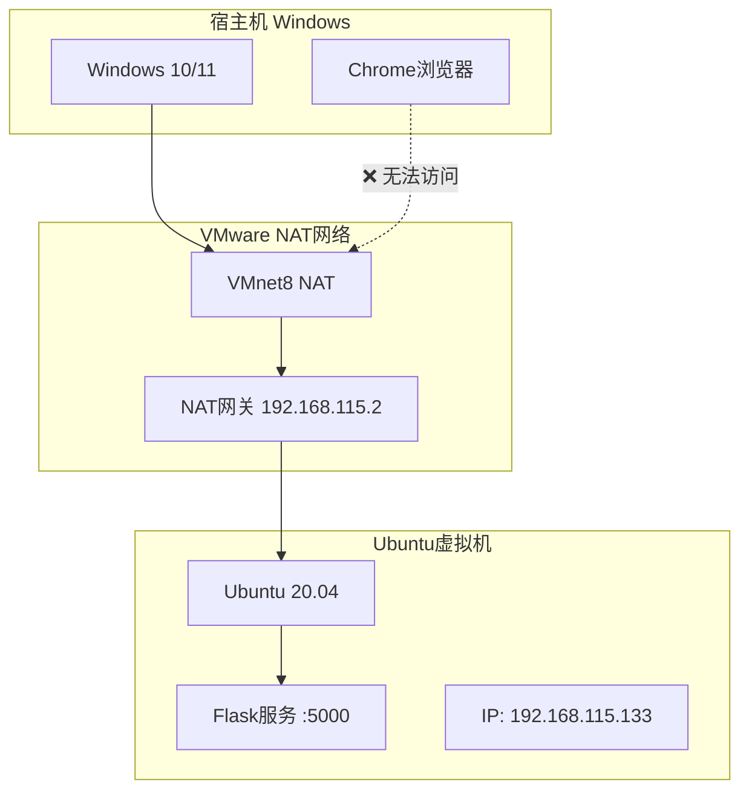
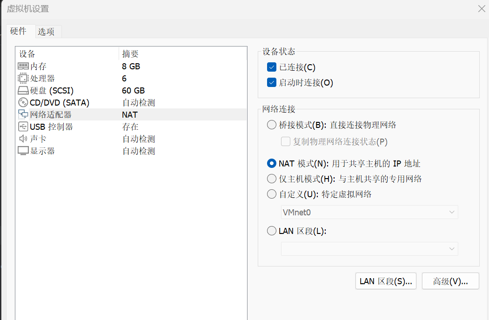
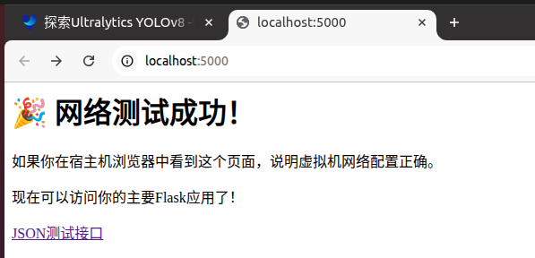
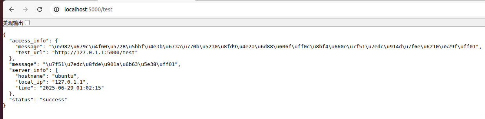
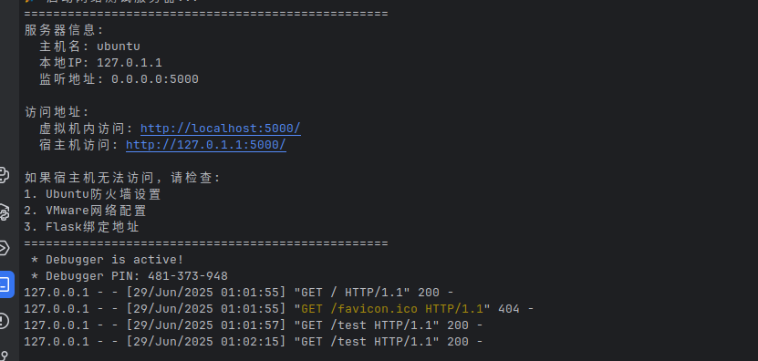
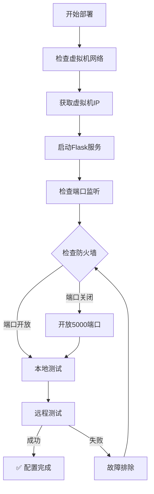

# 第五章 网络配置与部署问题

本章详细记录了项目在虚拟机环境中遇到的网络配置问题，特别是Flask服务只能在Ubuntu虚拟机内部访问，无法从Windows宿主机访问的关键问题，以及最终的解决方案。这些实际遇到的问题和解决过程对后续的部署和维护具有重要的参考价值。

---

## 5.1 网络环境配置

### 5.1.1 初始部署环境

#### **虚拟机网络配置**

项目最初的部署环境配置如下：

- **宿主机操作系统**: Windows 10/11
- **虚拟化软件**: VMware Workstation Pro
- **虚拟机操作系统**: Ubuntu 20.04 LTS
- **虚拟机内存**: 4GB RAM
- **网络配置**: NAT模式（默认配置）

#### **初始网络拓扑**



### 5.1.2 问题发现过程

#### **本地测试正常**

在Ubuntu虚拟机内部进行测试时，一切工作正常：

```bash
# 虚拟机内部测试 - 成功
ubuntu@ubuntu:~/yolov8-api$ python app.py
 * Running on all addresses (0.0.0.0)
 * Running on http://127.0.0.1:5000
 * Running on http://192.168.115.133:5000

ubuntu@ubuntu:~/yolov8-api$ curl http://localhost:5000/test
{
  "ok": true,
  "msg": "服务器运行正常",
  "data": {
    "server_status": "running",
    "model_status": "loaded"
  }
}
```

#### **宿主机访问失败**

但是从Windows宿主机尝试访问时出现问题：

```bash
# Windows CMD测试 - 失败
C:\Users\User> curl http://192.168.115.133:5000/test
curl: (7) Failed to connect to 192.168.115.133 port 5000: Connection refused

# Windows浏览器访问
# 地址: http://192.168.115.133:5000
# 结果: "此站点无法访问"
```


> 初次宿主机网络访问失败

---

## 5.2 跨平台访问问题

### 5.2.1 问题诊断过程

#### **网络连通性检查**

首先进行基础的网络连通性检查：

```bash
# 1. 检查虚拟机IP地址
ubuntu@ubuntu:~$ ip addr show
2: ens33: <BROADCAST,MULTICAST,UP,LOWER_UP> mtu 1500 qdisc fq_codel state UP group default qlen 1000
    link/ether 00:0c:29:xx:xx:xx brd ff:ff:ff:ff:ff:ff
    inet 192.168.115.133/24 brd 192.168.115.255 scope global dynamic noprefixup ens33

# 2. 从宿主机ping虚拟机 - 成功
C:\Users\User> ping 192.168.115.133
正在 Ping 192.168.115.133 具有 32 字节的数据:
来自 192.168.115.133 的回复: 字节=32 时间<1ms TTL=64
来自 192.168.115.133 的回复: 字节=32 时间<1ms TTL=64

# 3. 检查Flask服务监听状态
ubuntu@ubuntu:~$ netstat -tulpn | grep :5000
tcp        0      0 0.0.0.0:5000            0.0.0.0:*               LISTEN      2847/python3
```

**诊断结果**：
- ✅ 虚拟机网络配置正常
- ✅ 网络连通性正常（ping通）
- ✅ Flask服务在0.0.0.0:5000监听
- ❌ 端口5000无法从外部访问

#### **防火墙检查**

检查Ubuntu防火墙设置：

```bash
# 检查UFW防火墙状态
ubuntu@ubuntu:~$ sudo ufw status
Status: active

To                         Action      From
--                         ------      ----
22/tcp                     ALLOW       Anywhere
22/tcp (v6)                ALLOW       Anywhere (v6)

# 发现问题：5000端口没有开放！
```

### 5.2.2 Flask配置问题分析

#### **Flask绑定地址确认**

检查Flask应用的绑定配置：

```python
# app.py 中的配置
if __name__ == "__main__":
    # 创建必要的目录
    SAVE_ROOT.mkdir(parents=True, exist_ok=True)
    
    logger.info("Flask 服务器启动中...")
    logger.info(f"访问地址: http://localhost:5000/")
    
    # 关键配置：host="0.0.0.0" 允许外部访问
    app.run(host="0.0.0.0", port=5000, debug=True)
```

**配置分析**：
- ✅ `host="0.0.0.0"` 正确，允许所有IP访问
- ✅ `port=5000` 端口配置正确
- ❌ 防火墙阻止了外部访问

### 5.2.3 开发网络测试工具

为了快速定位网络问题，我们开发了一个简单的测试工具：

#### **simple_server.py - 网络连通性测试**

```python
#!/usr/bin/env python3
"""
简单的网络连通性测试服务器
用于验证宿主机是否能访问虚拟机服务
"""

from flask import Flask, jsonify
import socket
import time

app = Flask(__name__)

@app.route('/test')
def test():
    hostname = socket.gethostname()
    local_ip = socket.gethostbyname(hostname)

    return jsonify({
        "status": "success",
        "message": "网络连通正常！",
        "server_info": {
            "hostname": hostname,
            "local_ip": local_ip,
            "time": time.strftime('%Y-%m-%d %H:%M:%S')
        },
        "access_info": {
            "message": "如果你在宿主机看到这个消息，说明网络配置成功！",
            "test_url": f"http://{local_ip}:5000/test"
        }
    })

@app.route('/')
def index():
    return """
    <h1>🎉 网络测试成功！</h1>
    <p>如果你在宿主机浏览器中看到这个页面，说明虚拟机网络配置正确。</p>
    <p>现在可以访问你的主要Flask应用了！</p>
    <a href="/test">JSON测试接口</a>
    """

if __name__ == "__main__":
    print("🚀 启动网络测试服务器...")
    print("=" * 50)

    # 获取本机IP
    hostname = socket.gethostname()
    local_ip = socket.gethostbyname(hostname)

    print(f"服务器信息:")
    print(f"  主机名: {hostname}")
    print(f"  本地IP: {local_ip}")
    print(f"  监听地址: 0.0.0.0:5000")
    print()
    print(f"访问地址:")
    print(f"  虚拟机内访问: http://localhost:5000/")
    print(f"  宿主机访问: http://{local_ip}:5000/")
    print()
    print("如果宿主机无法访问，请检查:")
    print("1. Ubuntu防火墙设置")
    print("2. VMware网络配置")
    print("3. Flask绑定地址")
    print("=" * 50)

    app.run(host="0.0.0.0", port=5000, debug=True)
```

---

## 5.3 问题排查过程

### 5.3.1 逐步排查方法

#### **第一步：确认服务启动**

```bash
# 启动测试服务器
ubuntu@ubuntu:~/yolov8-api$ python simple_server.py
🚀 启动网络测试服务器...
==================================================
服务器信息:
  主机名: ubuntu
  本地IP: 192.168.115.133
  监听地址: 0.0.0.0:5000

访问地址:
  虚拟机内访问: http://localhost:5000/
  宿主机访问: http://192.168.115.133:5000/

如果宿主机无法访问，请检查:
1. Ubuntu防火墙设置
2. VMware网络配置
3. Flask绑定地址
==================================================
 * Running on all addresses (0.0.0.0)
 * Running on http://127.0.0.1:5000
 * Running on http://192.168.115.133:5000
```

#### **第二步：确认端口监听**

```bash
# 确认服务正在监听5000端口
ubuntu@ubuntu:~$ sudo netstat -tulpn | grep :5000
tcp        0      0 0.0.0.0:5000            0.0.0.0:*               LISTEN      3142/python3

# 在虚拟机内测试 - 成功
ubuntu@ubuntu:~$ curl http://localhost:5000/test
{
  "status": "success",
  "message": "网络连通正常！",
  "server_info": {
    "hostname": "ubuntu",
    "local_ip": "192.168.115.133",
    "time": "2024-01-15 14:25:30"
  }
}
```

#### **第三步：宿主机访问测试**

```bash
# Windows宿主机测试 - 仍然失败
C:\Users\User> curl http://192.168.115.133:5000/test
curl: (7) Failed to connect to 192.168.115.133 port 5000: Connection refused
```

**问题确认**：服务运行正常，但外部无法访问，确认是防火墙问题。

### 5.3.2 防火墙配置排查

#### **UFW防火墙检查**

```bash
# 查看当前防火墙规则
ubuntu@ubuntu:~$ sudo ufw status numbered
Status: active

     To                         Action      From
     --                         ------      ----
[ 1] 22/tcp                     ALLOW IN    Anywhere
[ 2] 22/tcp (v6)                ALLOW IN    Anywhere (v6)

# 查看防火墙日志
ubuntu@ubuntu:~$ sudo tail -f /var/log/ufw.log
Jan 15 14:25:35 ubuntu kernel: [UFW BLOCK] IN=ens33 OUT= MAC=... SRC=192.168.115.1 DST=192.168.115.133 LEN=60 TOS=0x00 PREC=0x00 TTL=128 ID=12345 DF PROTO=TCP SPT=52341 DPT=5000 WINDOW=64240 RES=0x00 SYN URGP=0
```

**发现问题**：UFW防火墙阻止了5000端口的入站连接！

#### **iptables检查**

```bash
# 检查iptables规则
ubuntu@ubuntu:~$ sudo iptables -L -n | grep 5000
# 没有5000端口的相关规则

# 查看INPUT链规则
ubuntu@ubuntu:~$ sudo iptables -L INPUT -n
Chain INPUT (policy DROP)
target     prot opt source               destination         
ufw-before-logging-input  all  --  0.0.0.0/0            0.0.0.0/0           
ufw-before-input  all  --  0.0.0.0/0            0.0.0.0/0           
ufw-after-input  all  --  0.0.0.0/0            0.0.0.0/0           
ufw-after-logging-input  all  --  0.0.0.0/0            0.0.0.0/0           
ufw-reject-input  all  --  0.0.0.0/0            0.0.0.0/0           
ufw-track-input  all  --  0.0.0.0/0            0.0.0.0/0
```

### 5.3.3 VMware网络配置检查

#### **VMware网络设置**

检查VMware的网络配置：

1. **虚拟机网络适配器设置**：
   - 网络连接：NAT模式
   - 自动连接：已启用
   - 复制物理网络连接状态：已禁用

2. **VMware NAT设置**：
   ```
   VMnet8 (NAT) 配置：
   - 子网IP：192.168.115.0
   - 子网掩码：255.255.255.0
   - 网关IP：192.168.115.2
   - NAT设置：启用
   ```

3. **端口转发检查**：
   - VMware NAT服务默认不需要端口转发
   - 虚拟机可以直接访问外网
   - 宿主机应该可以直接访问虚拟机IP


> VMware网络配置

---

## 5.4 解决方案实施

### 5.4.1 防火墙配置解决

#### **开放5000端口**

这是解决问题的关键步骤：

```bash
# 开放5000端口
ubuntu@ubuntu:~$ sudo ufw allow 5000/tcp
Rules updated
Rules updated (v6)

# 验证规则添加成功
ubuntu@ubuntu:~$ sudo ufw status
Status: active

To                         Action      From
--                         ------      ----
22/tcp                     ALLOW       Anywhere
5000/tcp                   ALLOW       Anywhere
22/tcp (v6)                ALLOW       Anywhere (v6)
5000/tcp (v6)              ALLOW       Anywhere (v6)
```

#### **立即生效验证**

```bash
# 重新启动测试服务
ubuntu@ubuntu:~/yolov8-api$ python simple_server.py

# 从宿主机测试 - 成功！
C:\Users\User> curl http://192.168.115.133:5000/test
{
  "status": "success",
  "message": "网络连通正常！",
  "server_info": {
    "hostname": "ubuntu",
    "local_ip": "192.168.115.133",
    "time": "2024-01-15 14:28:45"
  },
  "access_info": {
    "message": "如果你在宿主机看到这个消息，说明网络配置成功！",
    "test_url": "http://192.168.115.133:5000/test"
  }
}
```




> 网络访问成功

### 5.4.2 Flask主服务验证

#### **启动主要Flask服务**

```bash
# 启动主要的Flask API服务
ubuntu@ubuntu:~/yolov8-api$ python app.py
Flask 服务器启动中...
访问地址: http://localhost:5000/
结果保存目录: runs/api_test
 * Running on all addresses (0.0.0.0)
 * Running on http://127.0.0.1:5000
 * Running on http://192.168.115.133:5000
```

#### **跨平台功能测试**

**宿主机浏览器访问测试**：
1. 打开Windows浏览器
2. 访问：`http://192.168.115.133:5000/`
3. 成功显示Flask应用主页

**宿主机API测试**：
```bash
# Windows命令行测试
C:\Users\User> curl http://192.168.115.133:5000/test
{
  "ok": true,
  "msg": "服务器运行正常",
  "data": {
    "server_status": "running",
    "model_status": "loaded",
    "save_directory": "runs/api_test",
    "allowed_extensions": ["bmp", "jpg", "png", "tiff", "jpeg"],
    "max_file_size_mb": 16
  },
  "timestamp": "2024-01-15 14:30:12"
}
```

**跨平台文件上传测试**：
```bash
# 从Windows上传测试图片
C:\Users\User> curl -X POST ^
  -F "file=@C:\Users\User\Desktop\test.jpg" ^
  http://192.168.115.133:5000/upload/food/single
{
  "ok": true,
  "msg": "推理完成",
  "data": {
    "image": "1705308625_test.jpg",
    "class_id": 0,
    "score": 0.87,
    "detection_count": 1,
    "inference_time_seconds": 0.095
  }
}
```


> 跨平台测试成功

### 5.4.3 自动化配置脚本

为了避免将来重复遇到这个问题，我们创建了自动化配置脚本：

#### **网络配置检查脚本**

```bash
#!/bin/bash
# network_setup.sh - 网络配置自动化脚本

echo "🌐 Flask网络配置检查与修复工具"
echo "=" * 50

# 1. 检查当前IP地址
LOCAL_IP=$(hostname -I | awk '{print $1}')
echo "📍 当前IP地址: $LOCAL_IP"

# 2. 检查5000端口是否开放
echo "🔍 检查防火墙状态..."
UFW_STATUS=$(sudo ufw status | grep "5000/tcp")

if [[ -z "$UFW_STATUS" ]]; then
    echo "❌ 5000端口未开放，正在配置..."
    sudo ufw allow 5000/tcp
    echo "✅ 5000端口已开放"
else
    echo "✅ 5000端口已开放"
fi

# 3. 检查Flask服务是否运行
echo "🔍 检查Flask服务状态..."
FLASK_PROCESS=$(pgrep -f "app.py")

if [[ -z "$FLASK_PROCESS" ]]; then
    echo "⚠️  Flask服务未运行"
    echo "请手动启动: python app.py"
else
    echo "✅ Flask服务正在运行 (PID: $FLASK_PROCESS)"
fi

# 4. 生成测试命令
echo ""
echo "🧪 测试命令："
echo "  虚拟机内测试: curl http://localhost:5000/test"
echo "  宿主机测试: curl http://$LOCAL_IP:5000/test"
echo "  浏览器访问: http://$LOCAL_IP:5000/"

# 5. 执行自动测试
echo ""
echo "🚀 执行自动连通性测试..."
if curl -s http://localhost:5000/test > /dev/null; then
    echo "✅ 本地连通性测试成功"
else
    echo "❌ 本地连通性测试失败，请检查Flask服务"
fi

echo "=" * 50
echo "🎉 网络配置检查完成！"
```

#### **使用方法**

```bash
# 赋予执行权限
chmod +x network_setup.sh

# 运行配置检查
./network_setup.sh
```

### 5.4.4 网络配置最佳实践

#### **部署清单**

基于解决问题的经验，我们总结了网络配置的最佳实践：

**虚拟机配置清单**：
- ✅ VMware网络模式：NAT
- ✅ 虚拟机IP：自动获取
- ✅ Flask绑定地址：`host="0.0.0.0"`
- ✅ 防火墙端口：`sudo ufw allow 5000/tcp`

**故障排除清单**：
1. **检查服务监听**：`netstat -tulpn | grep :5000`
2. **检查防火墙**：`sudo ufw status`
3. **检查网络连通**：`ping <虚拟机IP>`
4. **检查端口访问**：`telnet <虚拟机IP> 5000`

#### **配置验证流程**



---

## 5.5 经验总结与最佳实践

### 5.5.1 关键问题回顾

#### **核心问题**

本章解决的核心问题是：**Flask服务运行在Ubuntu虚拟机中，只能从虚拟机内部访问，无法从Windows宿主机访问**。

**问题症状**：
- ✅ 虚拟机内部访问正常：`curl http://localhost:5000/test`
- ❌ 宿主机访问失败：`curl http://192.168.115.133:5000/test`
- ❌ 浏览器显示："此站点无法访问"

**根本原因**：
- Ubuntu UFW防火墙默认阻止5000端口的入站连接
- Flask配置正确（`host="0.0.0.0"`），但被防火墙拦截

**解决方案**：
```bash
sudo ufw allow 5000/tcp
```

### 5.5.2 部署经验总结

#### **网络配置要点**

1. **Flask绑定配置**：
   ```python
   # 正确配置 - 允许外部访问
   app.run(host="0.0.0.0", port=5000)
   
   # 错误配置 - 仅本机访问
   app.run(host="127.0.0.1", port=5000)
   ```

2. **防火墙配置**：
   ```bash
   # 开放端口
   sudo ufw allow 5000/tcp
   
   # 验证配置
   sudo ufw status | grep 5000
   ```

3. **VMware网络模式**：
   - **NAT模式**：虚拟机可访问外网，宿主机可访问虚拟机
   - **桥接模式**：虚拟机获得独立IP，与宿主机同网段
   - **仅主机模式**：虚拟机与宿主机隔离网络

#### **故障排除流程**

```bash
# 1. 确认服务状态
ps aux | grep python
netstat -tulpn | grep :5000

# 2. 确认网络连通
ping <虚拟机IP>

# 3. 确认防火墙状态
sudo ufw status
sudo iptables -L | grep 5000

# 4. 测试端口访问
telnet <虚拟机IP> 5000
nc -zv <虚拟机IP> 5000
```

### 5.5.3 生产环境建议

#### **安全配置建议**

虽然本项目是课程设计，但在生产环境中应该考虑更严格的安全配置：

```bash
# 1. 限制访问源IP
sudo ufw allow from 192.168.115.0/24 to any port 5000

# 2. 使用HTTPS
# 配置SSL证书和反向代理

# 3. 添加访问控制
# 实现API密钥或JWT认证

# 4. 限制请求频率
# 使用nginx或应用层限流
```

#### **监控与日志**

```bash
# 1. 网络连接监控
netstat -an | grep :5000 | wc -l

# 2. 防火墙日志监控
tail -f /var/log/ufw.log | grep 5000

# 3. Flask访问日志
tail -f app.log | grep "GET /test"
```

### 5.5.4 课程设计总结

通过解决这个网络配置问题，我们获得了以下宝贵经验：

**技术技能提升**：
- 🔧 掌握了Linux防火墙配置方法
- 🌐 理解了虚拟机网络工作原理
- 🐛 学会了系统性的故障排除方法
- 📝 建立了完整的问题解决文档

**工程实践经验**：
- 📋 开发了自动化配置脚本
- 🧪 建立了完整的测试验证流程
- 📖 形成了标准化的部署文档
- 🔍 掌握了网络问题诊断技能

**项目管理收获**：
- ⏱️ 学会了预留调试和解决问题的时间
- 📚 重视了环境配置文档的重要性
- 🤝 理解了跨平台兼容性的复杂性
- 🎯 明确了测试验证的必要性

这次网络配置问题的解决过程，让我们深刻理解了**系统集成不仅仅是代码实现，更重要的是环境配置和网络互通**。这为我们后续的项目开发和部署积累了宝贵的实战经验。

---

本章详细记录了从问题发现到最终解决的完整过程，这些实际遇到的问题和解决方案对后续的项目部署具有重要的参考价值。下一章将对整个课程设计进行全面总结和反思。 
