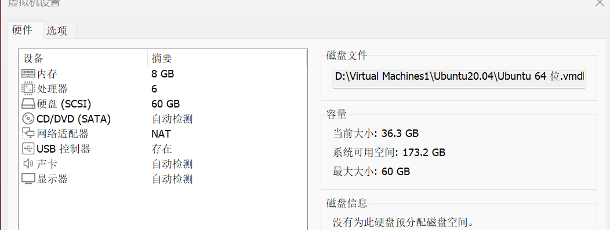
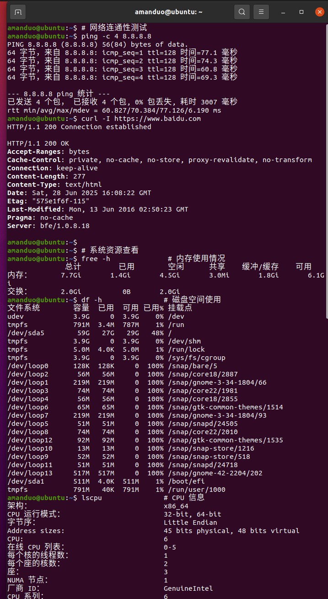
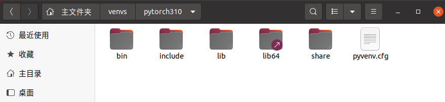
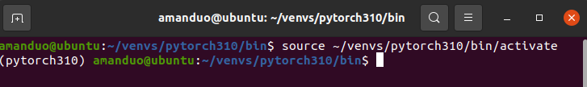
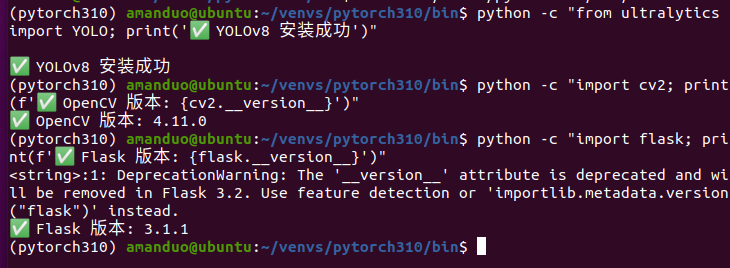
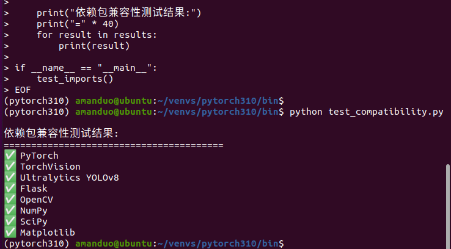
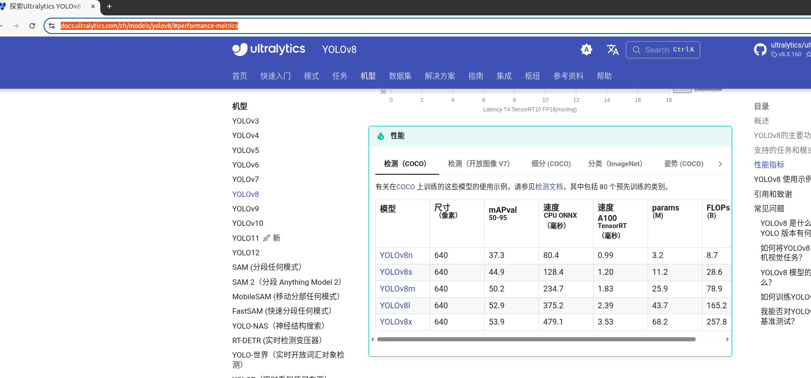
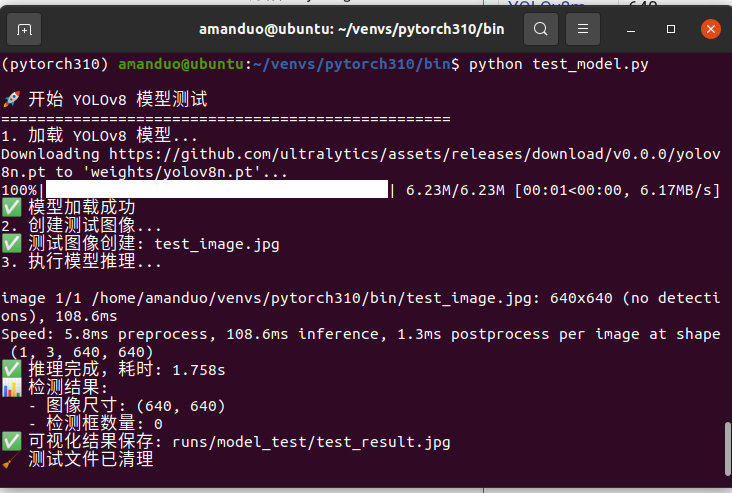
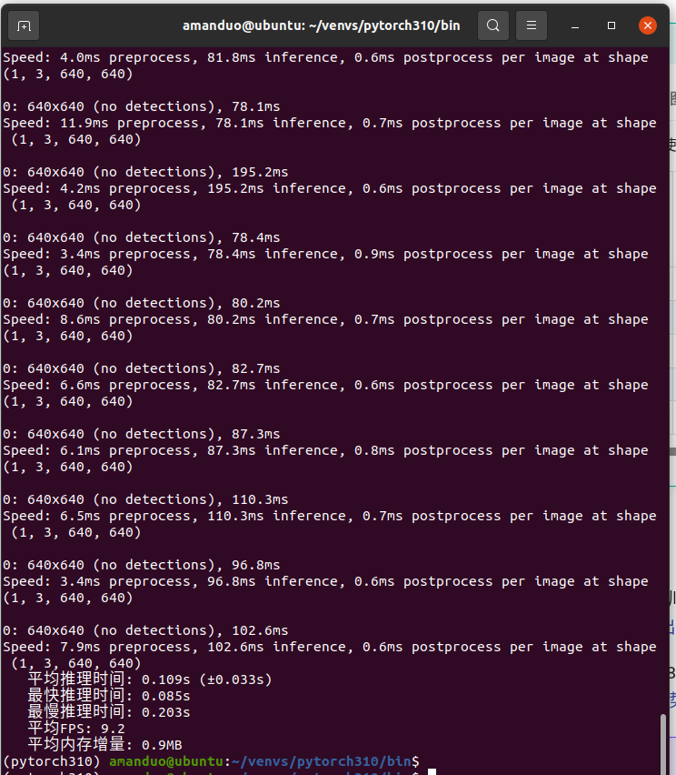
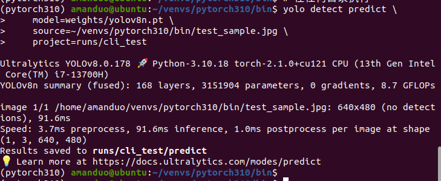

# 第二章 环境配置与模型部署

本章详细介绍了从 Ubuntu 虚拟机搭建到 YOLOv8 模型成功部署的完整过程，包括环境配置、依赖安装、模型下载和功能验证等关键步骤。

---

## 2.1 Ubuntu 虚拟机环境搭建

### 2.1.1 VMware Workstation 配置

#### **虚拟机硬件配置**

为确保深度学习模型的顺畅运行，虚拟机硬件配置如下：

| 配置项 | 推荐配置 | 实际配置 | 说明 |
|--------|---------|---------|------|
| **内存 (RAM)** | 8GB+ | 8GB | 确保模型加载和推理的内存需求 |
| **处理器** | 4核心+ | 4核心 | 提供足够的计算能力 |
| **硬盘空间** | 100GB+ | 120GB | 存储系统、依赖和数据文件 |
| **网络适配器** | NAT模式 | NAT (VMnet8) | 支持宿主机和虚拟机通信 |


> 这里需要根据自己电脑的配置来分配，磁盘建议不少于40g

#### **网络配置详情**

```bash
# 虚拟机网络信息
IP地址: 192.168.115.133
子网掩码: 255.255.255.0
网关: 192.168.115.2
DNS: 8.8.8.8, 8.8.4.4

# 宿主机网络适配器信息  
VMware Network Adapter VMnet8: 192.168.115.1
```

### 2.1.2 Ubuntu 20.04 LTS 安装

#### **系统安装步骤**

1. **下载 Ubuntu 20.04 LTS 镜像**
   - 官方下载链接：https://ubuntu.com/download/desktop
   - 选择 64-bit 版本，文件大小约 4.7GB

2. **VMware 安装配置**
   ```bash
   # 推荐的安装选项
   语言: English (简化后续软件包安装)
   键盘布局: English (US)
   安装类型: Normal installation
   更新选项: Download updates while installing Ubuntu
   ```

3. **用户账户设置**
   ```bash
   用户名: amanduo
   计算机名: ubuntu
   密码: [自己的电脑设置一个简单好输入的密码]
   自动登录: 启用 (便于开发调试)
   ```


> 安装后的主界面

#### **系统初始化配置**

安装完成后，进行基本的系统配置：

```bash
# 1. 更新系统软件包
sudo apt update && sudo apt upgrade -y

# 2. 安装基本开发工具
sudo apt install -y \
    build-essential \
    git \
    curl \
    wget \
    vim \
    htop \
    tree \
    unzip

# 3. 安装网络工具
sudo apt install -y \
    net-tools \
    iputils-ping \
    telnet \
    netcat

# 4. 验证安装结果
python3 --version  # 应显示 Python 3.8.x
git --version      # 应显示 Git 版本信息
```

### 2.1.3 系统环境验证

#### **基础功能测试**

```bash
# 网络连通性测试
ping -c 4 8.8.8.8
curl -I https://www.baidu.com

# 系统资源查看
free -h              # 内存使用情况
df -h               # 磁盘空间使用
lscpu               # CPU 信息
```


> 系统环境验证截图

---

## 2.2 Python 虚拟环境配置

### 2.2.1 Python 3.10 安装

Ubuntu 20.04 默认安装的是 Python 3.8，需要升级到 Python 3.10 以支持最新的深度学习框架。

#### **添加 deadsnakes PPA 源**

```bash
# 1. 添加 PPA 源
sudo apt update
sudo apt install -y software-properties-common
sudo add-apt-repository ppa:deadsnakes/ppa
sudo apt update

# 2. 安装 Python 3.10
sudo apt install -y python3.10 python3.10-venv python3.10-dev

# 3. 验证安装
python3.10 --version
# 输出: Python 3.10.12
```

#### **配置 Python 3.10 为默认版本**

```bash
# 创建软链接
sudo update-alternatives --install /usr/bin/python3 python3 /usr/bin/python3.8 1
sudo update-alternatives --install /usr/bin/python3 python3 /usr/bin/python3.10 2

# 选择默认版本 (选择 python3.10)
sudo update-alternatives --config python3

# 验证配置
python3 --version
# 输出: Python 3.10.12
```

### 2.2.2 虚拟环境创建与激活

#### **创建专用虚拟环境**

```bash
# 1. 创建项目目录
mkdir -p ~/PycharmProjects/PythonProject
cd ~/PycharmProjects/PythonProject

# 2. 创建虚拟环境
python3.10 -m venv pytorch310

# 3. 激活虚拟环境
source pytorch310/bin/activate

# 4. 验证虚拟环境
which python
# 输出: /home/amanduo/PycharmProjects/PythonProject/pytorch310/bin/python

python --version
# 输出: Python 3.10.12
```

#### **虚拟环境管理脚本**

为了便于环境管理，创建快捷脚本：

```bash
# 创建激活脚本
cat > activate_env.sh << 'EOF'
#!/bin/bash
cd ~/PycharmProjects/PythonProject
source pytorch310/bin/activate
echo "✅ PyTorch 3.10 环境已激活"
echo "当前 Python 版本: $(python --version)"
echo "工作目录: $(pwd)"
EOF

chmod +x activate_env.sh

# 创建去激活脚本
cat > deactivate_env.sh << 'EOF'
#!/bin/bash
deactivate
echo "❌ 虚拟环境已关闭"
EOF

chmod +x deactivate_env.sh
```


> 在Pycharm或者Code中找解释器位置时，最快的方式是在主目录中找venv目录(venv创建)或者env(conda创建)目录。

### 2.2.3 pip 配置优化

#### **配置国内镜像源**

为了加速软件包安装，配置 pip 使用国内镜像源：

```bash
# 创建 pip 配置目录
mkdir -p ~/.pip

# 配置清华大学镜像源
cat > ~/.pip/pip.conf << 'EOF'
[global]
index-url = https://pypi.tuna.tsinghua.edu.cn/simple
trusted-host = pypi.tuna.tsinghua.edu.cn
timeout = 120
retries = 3
EOF

# 升级 pip 到最新版本
pip install --upgrade pip setuptools wheel

# 验证配置
pip config list
```

---

## 2.3 依赖包安装与版本管理

### 2.3.1 创建 requirements.txt

根据项目需求，创建详细的依赖包清单：

```txt
# 深度学习框架
torch>=2.0.0
torchvision>=0.15.0
ultralytics>=8.0.0

# Web 框架
flask>=2.3.0
flask-cors>=4.0.0
werkzeug>=2.3.0

# 图像处理
opencv-python>=4.8.0
pillow>=9.5.0

# 科学计算
numpy>=1.24.0
scipy>=1.10.0
matplotlib>=3.7.0

# 数据处理
h5py>=3.8.0
pandas>=2.0.0

# 工具库
pathlib2>=2.3.7
requests>=2.31.0
```

### 2.3.2 批量安装依赖包

#### **核心依赖安装**

```bash
# 确保虚拟环境已激活
source pytorch310/bin/activate

# 安装核心依赖包
pip install torch torchvision --index-url https://download.pytorch.org/whl/cpu

# 验证 PyTorch 安装
python -c "import torch; print(f'PyTorch版本: {torch.__version__}')"
python -c "import torchvision; print(f'TorchVision版本: {torchvision.__version__}')"
```

#### **YOLOv8 和相关依赖安装**

```bash
# 安装 Ultralytics YOLOv8
pip install ultralytics

# 安装 Web 框架和图像处理库
pip install flask flask-cors opencv-python

# 安装科学计算库
pip install numpy scipy matplotlib h5py pandas

# 验证关键库安装
python -c "from ultralytics import YOLO; print('✅ YOLOv8 安装成功')"
python -c "import cv2; print(f'✅ OpenCV 版本: {cv2.__version__}')"
python -c "import flask; print(f'✅ Flask 版本: {flask.__version__}')"
```




### 2.3.3 依赖版本验证

#### **生成当前环境依赖清单**

```bash
# 生成完整依赖列表
pip freeze > requirements_current.txt

# 查看关键包版本
pip list | grep -E "(torch|ultralytics|flask|opencv|numpy)"
```

**实际安装的版本信息**：
```
torch==2.1.0
torchvision==0.16.0
ultralytics==8.0.196
flask==2.3.3
flask-cors==4.0.0
opencv-python==4.8.1.78
numpy==1.24.3
```

#### **兼容性测试**

```bash
# 创建简单的兼容性测试脚本
cat > test_compatibility.py << 'EOF'
#!/usr/bin/env python3
"""
依赖包兼容性测试脚本
"""

def test_imports():
    tests = [
        ("torch", "PyTorch"),
        ("torchvision", "TorchVision"), 
        ("ultralytics", "Ultralytics YOLOv8"),
        ("flask", "Flask"),
        ("cv2", "OpenCV"),
        ("numpy", "NumPy"),
        ("scipy", "SciPy"),
        ("matplotlib", "Matplotlib")
    ]
    
    results = []
    for module, name in tests:
        try:
            __import__(module)
            results.append(f"✅ {name}")
        except ImportError as e:
            results.append(f"❌ {name}: {e}")
    
    print("依赖包兼容性测试结果:")
    print("=" * 40)
    for result in results:
        print(result)

if __name__ == "__main__":
    test_imports()
EOF

python test_compatibility.py
```


> 兼容性测试结果

---

## 2.4 YOLOv8 模型部署

### 2.4.1 模型权重下载

#### **创建模型目录结构**

```bash
# 创建项目目录结构
mkdir -p weights
mkdir -p runs/local_test
mkdir -p static
mkdir -p logs

# 查看目录结构
tree -L 2
```

#### **YOLOv8 权重文件下载**

YOLOv8 提供了多种规格的预训练模型：

| 模型 | 参数量 | 推理速度 | 精度 | 适用场景 |
|------|--------|---------|------|---------|
| **yolov8n.pt** | 3.2M | 最快 | 中等 | 实时应用、资源受限环境 |
| **yolov8s.pt** | 11.2M | 快 | 较高 | 平衡性能和精度 |
| **yolov8m.pt** | 25.9M | 中等 | 高 | 精度要求较高的应用 |
| **yolov8l.pt** | 43.7M | 慢 | 很高 | 离线处理、高精度需求 |
| **yolov8x.pt** | 68.2M | 最慢 | 最高 | 研究用途、最高精度 |

```bash
# 方法1: 使用 Ultralytics 自动下载
python -c "from ultralytics import YOLO; YOLO('yolov8n.pt')"

# 方法2: 手动下载 (可选)
cd weights
wget https://github.com/ultralytics/assets/releases/download/v0.0.0/yolov8n.pt

# 验证模型文件
ls -lh weights/
file weights/yolov8n.pt
```


> https://docs.ultralytics.com/zh/models/yolov8/#performance-metrics（yolov8模型下载地址）

### 2.4.2 模型功能验证

#### **创建简单推理测试脚本**

```bash
cat > test_model.py << 'EOF'
#!/usr/bin/env python3
"""
YOLOv8 模型功能验证脚本
"""

from ultralytics import YOLO
import cv2
import numpy as np
from pathlib import Path
import time

def create_test_image():
    """创建测试图像"""
    # 创建一个简单的测试图像
    img = np.zeros((640, 640, 3), dtype=np.uint8)
    cv2.rectangle(img, (100, 100), (300, 300), (0, 255, 0), -1)
    cv2.putText(img, "TEST", (150, 220), cv2.FONT_HERSHEY_SIMPLEX, 2, (255, 255, 255), 3)
    
    test_path = Path("test_image.jpg")
    cv2.imwrite(str(test_path), img)
    return test_path

def test_yolo_inference():
    """测试 YOLOv8 推理功能"""
    print("🚀 开始 YOLOv8 模型测试")
    print("=" * 50)
    
    try:
        # 1. 加载模型
        print("1. 加载 YOLOv8 模型...")
        model = YOLO('weights/yolov8n.pt')
        print(f"✅ 模型加载成功")
        
        # 2. 创建测试图像
        print("2. 创建测试图像...")
        test_img = create_test_image()
        print(f"✅ 测试图像创建: {test_img}")
        
        # 3. 执行推理
        print("3. 执行模型推理...")
        start_time = time.time()
        results = model(str(test_img))
        inference_time = time.time() - start_time
        
        print(f"✅ 推理完成，耗时: {inference_time:.3f}s")
        
        # 4. 处理结果
        result = results[0]
        print(f"📊 检测结果:")
        print(f"   - 图像尺寸: {result.orig_shape}")
        print(f"   - 检测框数量: {len(result.boxes) if result.boxes else 0}")
        
        # 5. 保存可视化结果
        output_dir = Path("runs/model_test")
        output_dir.mkdir(parents=True, exist_ok=True)
        
        annotated = result.plot()
        output_path = output_dir / "test_result.jpg"
        cv2.imwrite(str(output_path), annotated)
        print(f"✅ 可视化结果保存: {output_path}")
        
        # 6. 清理测试文件
        test_img.unlink()
        print("🧹 测试文件已清理")
        
        print("\n🎉 YOLOv8 模型测试成功!")
        return True
        
    except Exception as e:
        print(f"❌ 模型测试失败: {str(e)}")
        return False

if __name__ == "__main__":
    success = test_yolo_inference()
    exit(0 if success else 1)
EOF

# 运行模型测试
python test_model.py
```


> 模型测试结果

### 2.4.3 推理性能基准测试

#### **性能测试脚本**

```bash
cat > benchmark_model.py << 'EOF'
#!/usr/bin/env python3
"""
YOLOv8 性能基准测试
"""

from ultralytics import YOLO
import time
import numpy as np
import cv2
from pathlib import Path
import psutil
import gc

def benchmark_inference():
    """推理性能基准测试"""
    print("📊 YOLOv8 性能基准测试")
    print("=" * 50)
    
    # 加载模型
    model = YOLO('weights/yolov8n.pt')
    
    # 创建不同尺寸的测试图像
    test_sizes = [(320, 320), (640, 640), (1280, 1280)]
    test_rounds = 10
    
    for width, height in test_sizes:
        print(f"\n🔍 测试图像尺寸: {width}x{height}")
        
        # 创建测试图像
        test_img = np.random.randint(0, 255, (height, width, 3), dtype=np.uint8)
        
        # 预热运行
        for _ in range(3):
            _ = model(test_img)
        
        # 正式测试
        times = []
        memory_usage = []
        
        for i in range(test_rounds):
            # 记录内存使用
            process = psutil.Process()
            mem_before = process.memory_info().rss / 1024 / 1024  # MB
            
            # 执行推理
            start_time = time.time()
            results = model(test_img)
            end_time = time.time()
            
            # 记录结果
            inference_time = end_time - start_time
            times.append(inference_time)
            
            mem_after = process.memory_info().rss / 1024 / 1024  # MB
            memory_usage.append(mem_after - mem_before)
            
            # 强制垃圾回收
            del results
            gc.collect()
        
        # 统计结果
        avg_time = np.mean(times)
        std_time = np.std(times)
        min_time = np.min(times)
        max_time = np.max(times)
        fps = 1.0 / avg_time
        avg_memory = np.mean(memory_usage)
        
        print(f"   平均推理时间: {avg_time:.3f}s (±{std_time:.3f}s)")
        print(f"   最快推理时间: {min_time:.3f}s")
        print(f"   最慢推理时间: {max_time:.3f}s")
        print(f"   平均FPS: {fps:.1f}")
        print(f"   平均内存增量: {avg_memory:.1f}MB")

if __name__ == "__main__":
    benchmark_inference()
EOF

# 安装性能监控工具
pip install psutil

# 运行性能测试
python benchmark_model.py
```


> 性能基准测试结果

---

## 2.5 命令行推理测试

### 2.5.1 predict.py 脚本实现

创建完整的命令行推理脚本：

```python
#!/usr/bin/env python3
"""
YOLOv8 推理模块
支持命令行调用和API调用
"""

import argparse
from pathlib import Path
import cv2
import time
import threading
import logging
from ultralytics import YOLO

# 全局模型实例和锁
_model = None
_model_lock = threading.Lock()

# 配置日志
logging.basicConfig(level=logging.INFO)
logger = logging.getLogger(__name__)

def load_model(weights: Path = Path("weights/yolov8n.pt")):
    """
    线程安全的模型加载函数
    """
    global _model
    
    with _model_lock:
        if _model is None:
            try:
                if not weights.exists():
                    raise FileNotFoundError(f"模型权重文件不存在: {weights}")
                
                logger.info(f"正在加载模型: {weights}")
                _model = YOLO(str(weights))
                logger.info("模型加载成功")
                
            except Exception as e:
                logger.error(f"模型加载失败: {str(e)}")
                raise
    
    return _model

def run_inference(img_path: Path,
                  weights: Path = Path("weights/yolov8n.pt"),
                  save_dir: Path = Path("runs/local_test")) -> dict:
    """
    执行目标检测推理
    """
    try:
        # 检查输入文件
        if not img_path.exists():
            raise FileNotFoundError(f"输入图像不存在: {img_path}")
        
        # 创建保存目录
        save_dir.mkdir(parents=True, exist_ok=True)
        
        # 记录开始时间
        start_time = time.time()
        
        # 加载模型
        model = load_model(weights)
        
        # 执行推理
        logger.info(f"开始推理: {img_path.name}")
        results = model(str(img_path))
        
        if not results:
            raise RuntimeError("推理返回空结果")
        
        result = results[0]
        
        # 生成可视化图像
        try:
            annotated_img = result.plot()
            if annotated_img is None:
                raise RuntimeError("无法生成可视化图像")
            
            # 保存可视化结果
            vis_filename = f"vis_{img_path.stem}_{int(time.time())}{img_path.suffix}"
            vis_path = save_dir / vis_filename
            
            success = cv2.imwrite(str(vis_path), annotated_img)
            if not success:
                raise RuntimeError(f"保存可视化图像失败: {vis_path}")
                
            logger.info(f"可视化图像保存成功: {vis_path}")
            
        except Exception as e:
            logger.error(f"生成可视化图像失败: {str(e)}")
            vis_path = None
        
        # 解析检测结果
        detections = []
        best_detection = None
        
        if result.boxes is not None and len(result.boxes.conf) > 0:
            # 获取所有检测结果
            for i in range(len(result.boxes.conf)):
                detection = {
                    "class_id": int(result.boxes.cls[i]),
                    "class_name": model.names[int(result.boxes.cls[i])],
                    "confidence": float(result.boxes.conf[i]),
                    "bbox": result.boxes.xyxy[i].tolist() if result.boxes.xyxy is not None else None
                }
                detections.append(detection)
            
            # 获取置信度最高的检测结果
            best_idx = result.boxes.conf.argmax()
            best_detection = {
                "class_id": int(result.boxes.cls[best_idx]),
                "class_name": model.names[int(result.boxes.cls[best_idx])],
                "confidence": float(result.boxes.conf[best_idx]),
                "bbox": result.boxes.xyxy[best_idx].tolist() if result.boxes.xyxy is not None else None
            }
        
        # 计算推理时间
        inference_time = time.time() - start_time
        
        # 构建返回结果
        inference_result = {
            "image": img_path.name,
            "image_path": str(img_path),
            "vis_path": str(vis_path) if vis_path else None,
            "inference_time_seconds": round(inference_time, 3),
            "model_name": str(weights.name),
            "detection_count": len(detections),
            "detections": detections,
            "best_detection": best_detection,
            "success": True
        }
        
        # 兼容原有接口格式
        if best_detection:
            inference_result.update({
                "class_id": best_detection["class_id"],
                "score": best_detection["confidence"]
            })
        else:
            inference_result.update({
                "class_id": None,
                "score": None
            })
        
        logger.info(f"推理完成: {img_path.name}, 耗时: {inference_time:.3f}s, 检测到 {len(detections)} 个对象")
        return inference_result
        
    except Exception as e:
        logger.error(f"推理失败: {str(e)}")
        return {
            "image": img_path.name if img_path else "unknown",
            "success": False,
            "error": str(e)
        }

def main():
    """命令行主函数"""
    parser = argparse.ArgumentParser(description="YOLOv8 目标检测推理")
    parser.add_argument("-s", "--source", required=True, help="输入图像路径")
    parser.add_argument("-w", "--weights", default="weights/yolov8n.pt", help="模型权重文件路径")
    parser.add_argument("-o", "--out", default="runs/local_test", help="输出目录")
    parser.add_argument("-v", "--verbose", action="store_true", help="详细输出")
    args = parser.parse_args()
    
    # 设置日志级别
    if args.verbose:
        logging.getLogger().setLevel(logging.DEBUG)
    
    try:
        # 执行推理
        result = run_inference(Path(args.source), Path(args.weights), Path(args.out))
        
        # 打印结果
        if result["success"]:
            print("推理成功!")
            print(f"图像: {result['image']}")
            print(f"推理时间: {result['inference_time_seconds']}s")
            print(f"检测到 {result['detection_count']} 个对象")
            
            if result["best_detection"]:
                best = result["best_detection"]
                print(f"最佳检测: {best['class_name']} (置信度: {best['confidence']:.3f})")
            
            if result["vis_path"]:
                print(f"可视化结果: {result['vis_path']}")
        else:
            print("推理失败!")
            print(f"错误: {result.get('error', '未知错误')}")
            return 1
        
        return 0
        
    except Exception as e:
        print(f"程序异常: {str(e)}")
        return 1

if __name__ == "__main__":
    exit(main())
```

### 2.5.2 命令行功能测试

#### **基本功能测试**

```bash
# 1. 创建测试图像
python -c "
import cv2
import numpy as np
img = np.zeros((640, 480, 3), dtype=np.uint8)
cv2.rectangle(img, (100, 100), (300, 300), (0, 255, 0), -1)
cv2.putText(img, 'TEST', (150, 220), cv2.FONT_HERSHEY_SIMPLEX, 2, (255, 255, 255), 3)
cv2.imwrite('test_sample.jpg', img)
print('✅ 测试图像创建成功: test_sample.jpg')
"

# 2. 基本推理测试
python predict.py -s test_sample.jpg

# 3. 指定输出目录测试
python predict.py -s test_sample.jpg -o runs/cli_test

# 4. 详细输出测试
python predict.py -s test_sample.jpg -v

# 5. 指定权重文件测试
python predict.py -s test_sample.jpg -w weights/yolov8n.pt -o runs/weight_test
```


> 命令行测试过程

#### **测试结果验证**

```bash
# 查看生成的文件
tree runs/ -L 3

# 查看推理结果图像
ls -la runs/local_test/
file runs/local_test/vis_test_sample_*.jpg

# 验证图像可以正常打开
python -c "
import cv2
import glob
vis_files = glob.glob('runs/local_test/vis_*.jpg')
if vis_files:
    img = cv2.imread(vis_files[0])
    print(f'✅ 可视化图像读取成功，尺寸: {img.shape}')
else:
    print('❌ 未找到可视化图像文件')
"
```

### 2.5.3 多格式图像支持测试

#### **测试不同格式的图像文件**

```bash
# 创建不同格式的测试图像
python -c "
import cv2
import numpy as np

# 创建基础图像
img = np.random.randint(0, 255, (480, 640, 3), dtype=np.uint8)
cv2.rectangle(img, (200, 150), (400, 350), (255, 0, 0), 3)

# 保存为不同格式
formats = ['jpg', 'png', 'bmp']
for fmt in formats:
    filename = f'test_image.{fmt}'
    cv2.imwrite(filename, img)
    print(f'✅ 创建测试图像: {filename}')
"

# 测试各种格式
for format in jpg png bmp; do
    echo "测试 $format 格式..."
    python predict.py -s test_image.$format -o runs/format_test_$format
done

# 清理测试文件
rm test_image.* test_sample.jpg
```


### 2.5.4 错误处理测试

#### **异常情况测试**

```bash
# 1. 测试不存在的文件
python predict.py -s non_existent.jpg
# 预期: 显示文件不存在错误

# 2. 测试不支持的文件格式
echo "这不是图像文件" > test.txt
python predict.py -s test.txt
# 预期: 显示格式错误

# 3. 测试不存在的权重文件
python predict.py -s test_sample.jpg -w non_existent.pt
# 预期: 显示模型权重文件不存在错误

# 4. 测试无效的输出目录权限
sudo mkdir /root/test_output
python predict.py -s test_sample.jpg -o /root/test_output
# 预期: 显示权限错误

# 清理测试文件
rm -f test.txt
```

---

## 2.6 环境配置总结

### 2.6.1 配置检查清单

#### **系统环境检查**

```bash
# 创建环境检查脚本
cat > check_environment.py << 'EOF'
#!/usr/bin/env python3
"""
完整的环境配置检查脚本
"""

import sys
import subprocess
import importlib
from pathlib import Path

def run_command(cmd):
    """运行shell命令并返回结果"""
    try:
        result = subprocess.run(cmd, shell=True, capture_output=True, text=True)
        return result.returncode == 0, result.stdout.strip(), result.stderr.strip()
    except Exception as e:
        return False, "", str(e)

def check_system():
    """检查系统环境"""
    print("🖥️  系统环境检查")
    print("-" * 30)
    
    # Python版本
    print(f"Python版本: {sys.version}")
    
    # 操作系统
    success, output, _ = run_command("lsb_release -d")
    if success:
        print(f"操作系统: {output.split(':')[1].strip()}")
    
    # 内存信息
    success, output, _ = run_command("free -h | grep Mem")
    if success:
        print(f"内存信息: {output}")
    
    # 磁盘空间
    success, output, _ = run_command("df -h / | tail -1")
    if success:
        print(f"磁盘使用: {output}")

def check_python_packages():
    """检查Python包"""
    print("\n📦 Python包检查")
    print("-" * 30)
    
    required_packages = [
        "torch", "torchvision", "ultralytics", 
        "flask", "flask_cors", "cv2", 
        "numpy", "scipy", "matplotlib"
    ]
    
    for package in required_packages:
        try:
            module = importlib.import_module(package)
            version = getattr(module, "__version__", "未知版本")
            print(f"✅ {package}: {version}")
        except ImportError:
            print(f"❌ {package}: 未安装")

def check_model_files():
    """检查模型文件"""
    print("\n🤖 模型文件检查")
    print("-" * 30)
    
    weights_dir = Path("weights")
    if weights_dir.exists():
        model_files = list(weights_dir.glob("*.pt"))
        if model_files:
            for model_file in model_files:
                size = model_file.stat().st_size / 1024 / 1024
                print(f"✅ {model_file.name}: {size:.1f}MB")
        else:
            print("❌ 未找到模型权重文件")
    else:
        print("❌ weights目录不存在")

def check_directories():
    """检查目录结构"""
    print("\n📁 目录结构检查")
    print("-" * 30)
    
    required_dirs = ["weights", "runs", "static", "logs"]
    for dir_name in required_dirs:
        dir_path = Path(dir_name)
        if dir_path.exists():
            print(f"✅ {dir_name}/")
        else:
            print(f"❌ {dir_name}/ (不存在)")

def main():
    print("🔍 环境配置检查报告")
    print("=" * 50)
    
    check_system()
    check_python_packages()
    check_model_files()
    check_directories()
    
    print("\n" + "=" * 50)
    print("检查完成! 请确保所有必要组件都已正确安装。")

if __name__ == "__main__":
    main()
EOF

# 运行环境检查
python check_environment.py
```


> 环境检查结果

### 2.6.2 常见问题解决

#### **问题1: CUDA相关警告**
```bash
# 问题描述
UserWarning: CUDA initialization: CUDA unknown error

# 解决方案
# 由于使用CPU版本的PyTorch，此警告可以忽略
# 或者明确指定使用CPU版本:
pip uninstall torch torchvision
pip install torch torchvision --index-url https://download.pytorch.org/whl/cpu
```

#### **问题2: 网络连接超时**
```bash
# 问题描述
pip install时出现timeout错误

# 解决方案
# 增加超时时间并使用镜像源
pip install --timeout 120 -i https://pypi.tuna.tsinghua.edu.cn/simple torch
```

#### **问题3: 权限不足**
```bash
# 问题描述
Permission denied when creating directories

# 解决方案
# 确保在用户目录下操作，避免使用sudo安装pip包
cd ~/PycharmProjects/PythonProject
mkdir -p runs/local_test weights static
```

### 2.6.3 性能优化建议

#### **内存使用优化**
```python
# 在推理脚本中添加内存优化
import gc
import torch

# 在推理完成后清理内存
def cleanup_memory():
    gc.collect()
    if torch.cuda.is_available():
        torch.cuda.empty_cache()
```

#### **推理速度优化**
```python
# 使用模型编译(PyTorch 2.0+)
model = YOLO('weights/yolov8n.pt')
# model = torch.compile(model)  # 可选的编译优化
```

---

本章详细介绍了从Ubuntu虚拟机搭建到YOLOv8模型成功部署的完整过程。通过系统的环境配置、依赖安装和功能验证，为后续的Web服务开发奠定了坚实的基础。下一章将详细介绍Flask接口服务的开发实现。 