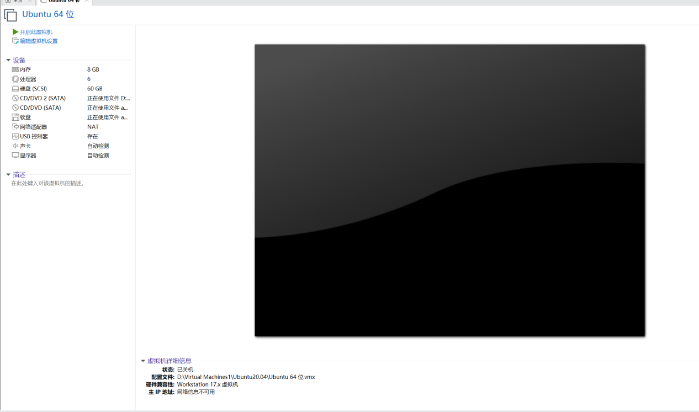

**本次实验实现了vmware中对linux系统ubuntu20.04安装、pycharm安装、python环境配置**

本次实验采用vmware虚拟机安装ubuntu 20.04版本进行。（还可以采取**双系统**或**WSL2**进行实验）

1. 首先进入**vmware**软件点击左上角文件 → 新建虚拟机  
     
   

2. 这一步直接勾选**典型**，点击下一步  
   

3. 接下来填写一个名字跟密码，这里的密码建议填写一个**简单**的密码，方便记忆和使用。  
     
   

4. 这里建议修改路径到**D盘**，一般D盘磁盘空间充足，C盘内存小会影响电脑运行速度。  
   

5. 这里建议磁盘大小为**40-80G**，磁盘空间分配太小会导致后续一些大型实验结果无法保存，且不会导致主机内存受到影响。然后勾选**将虚拟磁盘存储为单个文件**。  
   

6. 这里可以根据自己的电脑配置再具体调整参数，内存一般是4-8GB即可，处理器可以根据自己的电脑来，我这里是i7-13700H（共20线程），所以给的3×2=6 vCPU，给主机留14线程余量。  
     
   

7. 显示器这里勾选**加速3D图形**，显存一般默认的4GB。打印机一般用不到，可以点击左侧下面的移除进行移除，需要时可再修改增加。

8. 点击**完成**即可。  
     
   

9. 到这里一台新的虚拟机就搭建成功了，点击**开启虚拟机**就行。  
   

10. 进来之后一般是正常联网的，如果有问题，请检查上一步是否勾选 NAT 模式。

11. 建议使用 vmware 时连接键盘，这样操作比较方便。

12. 如果使用界面大小不舒服，可以在 setting 中 display 修改分辨率  
    

13. Date & Time 中设置时间地区，Regions & Languages 中设置语言和地区（只要时间一样就行，即 CST（UTC+8））。

14. 拼音输入法设置：manage installed languages → 添加 Chinese (simplified)，然后在 Language 行点击后选择汉语，再点击右侧设置图标，找到中文拼音即可。

15. 重启系统后即可切换至中文。  
    

16. 下载 PyCharm：可在官网找到 `.deb` 安装包（x86_64 架构），命令行或双击安装均可。

17. 在配置解释器的时候，先确认环境路径，然后在 PyCharm 的解释器路径中选择该环境即可。
